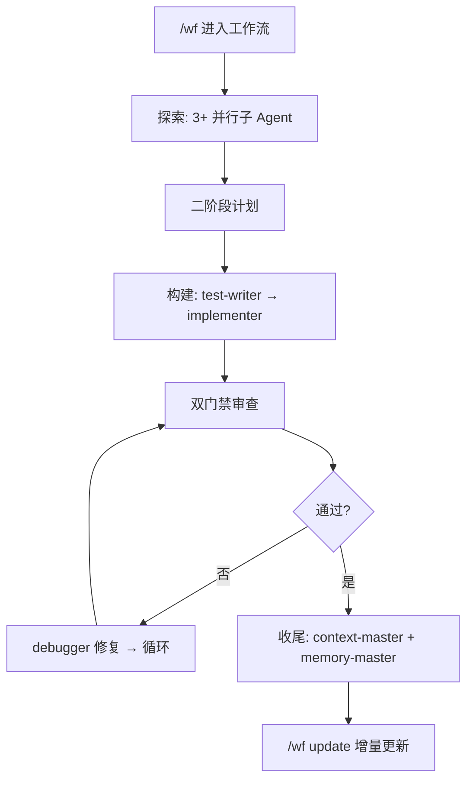

<p align="center">
  
  
  
  
</p>

<h1 align="center">create-harness-vibe-coding</h1>
<p align="center">
  <b>给你的 AI Agent 一个产品脚手架。一条命令，告别漂移。</b><br>
  <sub>想法 → 调研 → PRD → 架构 → 计划 → 构建 → 验证 → 反馈</sub>
</p>

## 一条命令，搞定一切。

```bash
npx create-harness-vibe-coding@latest my-project
```

## 一句话交给你的 Agent

> 已有项目？不用看文档。把下面这句话粘贴给你的 Agent。

```text
请按照 https://github.com/zingspark/create-harness-vibe-coding 的 README 为当前项目配置 create-harness-vibe-coding；编辑前先询问 Agent-link 安装前置问题；新项目走 0-1 bootstrap，老项目或老架构升级先 dry-run，保留现有文件，只合并缺失的 Harness 规范，然后遵循 Harness/SETUP.md。
```

就这两条路：
- **你来**：跑上面那条 `npx` 命令
- **交给 Agent**：把上面那句话贴给它

[English README](README.md)

---

| 你会得到 | 用途 |
|---------|------|
| `CLAUDE.md` + `Harness/README.md` | 精简根入口与动态文档路由器 |
| `Harness/PROGRESS.md` + `Harness/tasks/` | 全局任务索引与每任务进度胶囊 |
| `Harness/WF.md` + `/wf` | 长任务工作流：并行探索、二阶段计划、构建、审查、验证、恢复 |
| `/wf update` | 基于 GitHub 的增量脚手架更新，校验和安全 |
| `Harness/subagents.md` + `subagent-orchestrator` | 控制器主导的多 Agent 编排，含来源标注方法 |
| `memory-master` + `context-master` | 重复失败时自动触发记忆写入，以及非阻塞上下文压缩告警 |
| 调研 + PRD 模板 | 澄清想法、范围、非目标、验收标准 |
| 调研协议 | 路由调研 Agent、源搜索和回退工具 |
| 内置通用 Agent | 11 个 Agent：调研、规划、架构、测试、实现、调试、审查、验证、记忆、上下文 |
| Harness 架构文档 | 边界、端口、数据流、状态机 |
| 调度协议 | 轻量级并行 Agent 协调，无需调度器 |
| 扩展契约 | 保持技术栈特定 Agent 和 Skill 兼容 |
| 上下文加载协议 | 仅向各子 Agent 注入所需文档 |
| README 优化器 Skill | 可选的 README 保留、表格和经批准的架构图 |
| Skill 式加载器 | `.claude/skills/*` 路由生命周期、上下文和构建循环 |
| Harness 验证器 | 检查必需文件、Agent/Skill 注册、不变量 |
| `.claude/` 骨架 | Claude Code Agent、Skill、命令和规则的根运行时集成 |

---

## 为什么需要它

大多数 0-1 AI 编程项目在代码质量成为问题之前就已失败：

| 没有 Harness | 有了这个脚手架 |
|---|---|
| 想法直接跳到代码 | 生命周期强制走调研、PRD、范围 |
| Agent 读取过多上下文 | 文档路由器仅加载所需的 Harness 文件 |
| 子 Agent 收到模糊提示 | 上下文加载包定义角色、边界和返回格式 |
| 流程漂移不可见 | 验证器检查核心 Harness 就绪状态 |
| 架构悄然漂移 | 端口、数据流和状态文档标记边界变更 |
| 测试在实现之后才来 | 工作流要求先有失败测试或手动检查 |
| 长任务在失败后停滞 | `/wf` 添加心跳、恢复循环、3 次失败自动 memory-master |
| 长会话上下文膨胀 | `context-master` 在约 85% 窗口时给出非阻塞压缩告警 |
| 脚手架生成后腐烂 | `/wf update` 从 GitHub 拉取最新改进并校验和 |

---

## 工作原理

```text
npx scaffold
-> Claude 读取 Harness/SETUP.md
-> Harness 路由器仅选择所需文档
-> 填写 PRD / 调研 / 架构
-> 在 Harness/tasks/<id>/ 创建首个任务胶囊
-> 首个垂直切片被构建、测试、审查、验证、反馈
-> 验证器在发布前捕获缺失的项目事实
-> /wf update 从 GitHub 拉取最新脚手架改进
```

### Harness 理念

脚手架不预建业务代码。它给 Agent 一套紧凑的流程，把想法变成一个经验证的产品切片。

### Harness 工作流



---

## 文件结构

```
my-project/
├── CLAUDE.md              ← 简短启动规则 + 上下文纪律
├── AGENTS.md              ← 编程 Agent 入口
├── README.md              ← 项目构建/测试/git/运行备注
├── .gitignore
├── Harness/
│   ├── README.md          ← 动态文档路由器
│   ├── SETUP.md           ← 临时初始化指南（初始化后删除）
│   ├── MEMORY.md          ← 跨会话资源索引
│   ├── PROGRESS.md        ← 全局任务索引与跨任务决策
│   ├── PLAN.md            ← 已废弃 → 见 PROGRESS.md + tasks/
│   ├── .harness-version   ← 脚手架版本 + 文件校验和
│   ├── WF.md              ← 长任务工作流与恢复循环
│   ├── WF-MAX.md          ← 最大并行工作流（CEO→Manager→Worker 三级层级）
│   ├── lifecycle.md       ← 0-1 产品流程
│   ├── subagents.md       ← 控制器主导的子 Agent 编排
│   ├── context-loading.md ← 子 Agent 上下文包
│   ├── dispatch.md        ← 轻量级并行 Agent 协议
│   ├── extension.md       ← 技术栈特定 Agent/Skill 契约
│   ├── architecture.md    ← 分层规则、组件、ADR
│   ├── agent-workflow.md  ← TDD 循环、子 Agent 角色、写入集
│   ├── data-flow.md       ← 事件生命周期：正常 + 失败路径
│   ├── state-machines.md  ← 状态枚举、转换表、守卫
│   ├── domain/
│   │   └── ports.md       ← 端口契约：前置/后置条件、错误语义
│   ├── features/
│   │   └── _template.md   ← 功能文档模板
│   ├── tasks/
│   │   ├── _template/     ← 任务胶囊模板（复制以创建新任务）
│   │   └── <task-id>/     ← 每任务 PROGRESS.md + PLAN.md + 产出
│   ├── research/
│   │   ├── README.md
│   │   ├── PRD.md
│   │   └── research-results.md
│   ├── memory/
│   │   ├── tool-usage-reflections.md
│   │   ├── user-corrections-preferences.md
│   │   └── agent-lessons-patterns.md
│   ├── workflows/         ← 可选工作流文档
│   └── scripts/
│       └── validate-harness.mjs
├── .claude/
│   ├── settings.json     ← 基础权限
│   ├── agents/           ← 11 个通用 Agent + 技术栈特定
│   ├── skills/           ← Harness Skill + wf-update + 技术栈特定
│   ├── commands/
│   │   ├── wf.md          ← /wf — 进入工作流模式
│   │   ├── wf-max.md      ← /wf max — 最大并行模式
│   │   └── update.md      ← /wf update — GitHub 增量更新
│   ├── hooks/            ← 选定技术栈后配置自动化
│   └── rules/ecc/
│       └── common.md     ← 通用编码规则
└── tests/                ← 你的测试套件放在这里
```

`Harness/` 是 Harness 自有文档、状态、记忆、工作流和验证的默认目录。根目录 `.claude/` 保留在项目根目录，因为 Claude Code 在此发现 Agent、Skill、命令、设置、钩子和规则。

---

## 生态兼容性

| 平台 | 适配 |
|------|------|
| Claude Code | 原生 `CLAUDE.md`、`.claude/settings.json`、Agent、Skill、钩子 |
| Codex / Cursor / Gemini CLI | 作为文档优先的流程脚手架使用 |
| ECC / Superpowers / 工具箱 | 作为技术栈特定 Agent、Skill 和规则的可选来源 |

---

## 使用方式

### 人类

```bash
# 交互模式 — 提示输入项目名和目录
npx create-harness-vibe-coding@latest
```

### 已有项目

脚手架设计为可添加到已有仓库，不会静默替换项目文件。

有两种安装方式：

- **npx 安装**：确定性脚手架写入，显式冲突策略。适合需要可预测文件和清晰 dry-run 计划的场景。
- **Agent-link 安装**：将顶部的"一句话提示词"粘贴到 Claude Code、Codex、Cursor、Gemini CLI 或其他编程 Agent 中。这种方式更灵活：Agent 会读取本 README、检查现有项目、执行或模拟 dry-run、提出最小迁移方案。

Agent-link 安装前置问题，编辑前先询问：

仅询问影响写入、架构、安全或工作流的问题。最多问 3 个阻断性问题先行，其余记录安全默认值，仅在该选项变为活跃时再追问。

| 主题 | 何时询问 | 未回答时的默认值 |
| --- | --- | --- |
| 根 Agent 入口 | `CLAUDE.md`、`AGENTS.md`、`.claude/` 或其他 Agent 入口文件已存在 | 保留文件；合并 Harness 入口契约前先询问 |
| Harness 位置 | `docs/` 已用于 GitHub Pages、产品文档或生成的文档 | 使用根目录 `Harness/`；不将 Harness 文档写入 `docs/` |
| README 所有权 | 根 `README.md` 是公开产品页、包文档或高度定制化的 | 保留已有 README，提出最小化的 Development 章节 |
| README 优化 | 已有 README 陈旧、稀疏、缺少命令表格，或用户要求图表/精美文档 | 提供 `readme-optimizer`；默认仅追加 Development 备注直到用户批准结构调整或完全重写 |
| 扩展 | ECC、Superpowers、自定义规则或技术栈特定 Skill 可能有用 | 先推荐；仅在用户批准后安装 |
| Skill | 技术栈已知且可选 Skill 可改进测试、前端、后端、审查或浏览器证据 | 仅在用户批准后安装 1-2 个相关 Skill |
| CI/CD | CI 配置已存在或项目缺少测试/构建关卡 | 先文档化已有命令；仅在用户批准后添加 CI/CD |
| 验证深度 | 影响浏览器可见、API、数据库、认证、支付或部署行为 | 要求真实命令证据；相关时要求浏览器/API 证据 |
| 记忆/隐私 | 仓库包含敏感领域数据、客户数据、密钥或私有工作流 | 仅启用记忆索引；永不记录密钥或私有数据 |
| 分支/工作树 | 项目有未提交更改、高风险迁移或并行实现通道 | 保留当前工作树；在广泛编辑前提出分支/工作树 |
| 包管理器/技术栈 | 存在多个包管理器、monorepo 应用或技术栈边界不清晰 | 在写入前询问哪个工作空间/应用在范围内 |

如果 `CLAUDE.md` 已存在，Agent 必须告知用户它是根 Agent 入口契约，并在重构、合并、备份或替换前请求确认。正确的结果是用户批准的合并，保留项目特定规则同时添加 Harness 启动、记忆、路由器、工作流和子 Agent 编排契约。

```bash
# 先预览写入计划。不创建任何文件或目录。
npx create-harness-vibe-coding@latest my-app . -y --dry-run

# 保留已有文件，只添加缺失的 Harness 文件。
npx create-harness-vibe-coding@latest my-app . -y --on-conflict skip
```

默认情况下，冲突在写入前失败。这保护已有的 `CLAUDE.md`、`AGENTS.md`、`README.md`、`.claude/`、`.gitignore`、项目文档和脚本免受意外替换。

| 冲突模式 | 含义 | 风险 |
|----------|------|------|
| `fail` | 默认。目标文件已存在则停止。 | 已有项目最安全；需后续决策。 |
| `skip` | 保留已有文件，仅创建缺失文件。 | 已有根入口可能需要手动链接到新的 `Harness/` 文档或工作流。 |
| `backup` | 将已有文件重命名为 `<name>.harness-backup`，然后写入脚手架文件。 | 删除前复查备份；重复运行可能需要清理。 |
| `overwrite` | 用脚手架版本替换已有文件。 | 破坏性的。仅在审查 `--dry-run` 输出后或经明确批准后使用。 |

推荐的 Agent 引导流程：

```bash
node bin/create-harness-vibe-coding.js my-app . -y --dry-run
node bin/create-harness-vibe-coding.js my-app . -y --on-conflict skip
node Harness/scripts/validate-harness.mjs
```

文件安装后，Agent 必须在正常项目工作前遵循 `Harness/SETUP.md`。`CLAUDE.md` 仅指向必需的 Harness 路由器；设置细节属于 `Harness/SETUP.md`。

如果 `AGENTS.md` 已存在，Agent 必须在合并或替换前请求用户同意。`AGENTS.md` 是根 Agent 入口契约的一部分，与 `CLAUDE.md` 一样。

开发命令、构建脚本、git 约定和发布流程放在根 `README.md`。代码架构放在 `Harness/architecture.md` 或功能文档中，不放在 `CLAUDE.md`。

### Agent / CI/CD

Agent 和自动化可以通过 `-y` 跳过所有提示：

```bash
# 使用默认值的单行命令（项目名 = my-vibe-project）
npx create-harness-vibe-coding@latest -y

# 指定项目名，自动目录
npx create-harness-vibe-coding@latest my-app -y

# 指定项目名和显式目录
npx create-harness-vibe-coding@latest my-app ./dist/my-app -y

# CI 安全的已有项目预览
npx create-harness-vibe-coding@latest my-app . -y --dry-run

# CI 安全的已有项目添加，不替换文件
npx create-harness-vibe-coding@latest my-app . -y --on-conflict skip
```

| 标志 | 用途 |
|------|------|
| `-y`、`--yes` | 跳过所有提示。使用位置参数或默认值。 |
| `--dry-run` | 打印计划的创建、跳过、备份、覆盖和冲突，但不写入。 |
| `--on-conflict <mode>` | 文件已存在时选择 `fail`、`skip`、`backup` 或 `overwrite`。 |
| `--list-options` | 打印可选工作流目录和预设。 |
| `--with <ids>` | 按逗号分隔的 id 添加可选工作流。 |
| `--without <ids>` | 移除由 `--preset` 或 `--with` 选中的可选工作流。 |
| `--preset <name>` | 添加命名工作流预设，如 `web-app` 或 `fullstack`。 |
| `-h`、`--help` | 打印用法并退出。 |

> [!TIP]
> Agent 应始终传递 `-y` 以避免在交互提示上挂起。
> 如果 Agent 需要先了解 CLI 表面，用 `--help` 和 `--list-options` 运行。

### 可选工作流

可选工作流是在生成时显式选择的本地模板资产。它们不安装包依赖也不获取远程市场。

```bash
# 显示可用的可选工作流 id 和预设
npx create-harness-vibe-coding@latest --list-options

# 添加单个工作流
npx create-harness-vibe-coding@latest my-app -y --with browser-e2e,ts-react-frontend

# 为常见 Web 应用工作添加预设
npx create-harness-vibe-coding@latest my-app -y --preset web-app

# 添加更广泛的前端/后端/PR审查预设
npx create-harness-vibe-coding@latest my-app -y --preset fullstack

# 裁剪预设而不重新声明每个已选工作流
npx create-harness-vibe-coding@latest my-app -y --preset fullstack --without github-pr-review
```

内置可选工作流 id：

| 工作流 | 何时使用 |
|--------|----------|
| `browser-e2e` | 浏览器冒烟测试、截图、追踪和 UI 证据。 |
| `ui-ux-review` | 截图驱动的响应式、无障碍和润色审查。 |
| `github-pr-review` | PR diff、检查、审查发现和 CI 证据。 |
| `python-backend` | Python API/后端工作，unittest 或 pytest 验证。 |
| `ts-react-frontend` | TypeScript React 工作，类型检查、组件测试、构建和浏览器冒烟。 |

预设：

| 预设 | 包含 |
|------|------|
| `web-app` | `ts-react-frontend`、`browser-e2e`、`ui-ux-review` |
| `fullstack` | `ts-react-frontend`、`python-backend`、`browser-e2e`、`github-pr-review` |

### WF 模式

适用于长任务、困难任务、多文件、多 Agent 或重复失败。输入 `/wf`、`wf mode`、`workflow mode` 或 `wk mode` 进入。

```text
/wf — 触发完整的 Ralph 风格 Harness 循环：
  摄入（95% 信心门槛）
  -> 3+ 并行只读子 Agent（planner + architect + researcher）
  -> 综合 + 二阶段计划 → 写入 Harness/tasks/<id>/PLAN.md
  -> test-writer → implementer → reviewers → verifier
  -> 失败？debugger → review → verify → 循环
  -> 收尾：context-master + memory-master 整合知识
```

| 阶段 | 做什么 | 心跳 |
|------|--------|------|
| 摄入 | 陈述目标、信心、风险、写入边界 | 调度前更新 |
| 探索 | 3-5 个并行只读子 Agent | 每个子 Agent 返回后 |
| 二阶段计划 | 综合发现到 `tasks/<id>/PLAN.md` | 计划写入后 |
| 构建 | `test-writer` → `implementer` 串行通道 | 长命令前后 |
| 审查 | 规格审查，然后代码质量审查 | 每个审查门禁后 |
| 验证 | 运行声明的检查，记录证据 | 每次验证后 |
| 恢复 | `debugger` → 修复 → 审查 → 验证 → 循环 | 每次失败后 |
| 收尾 | `context-master` 提取 → `memory-master` 整合 → 归档 | 最终心跳 |

WF 模式还自动调度：
- **`memory-master`** 在 3 次同类失败时（在询问用户前记录模式）
- **`context-master`** 在约 85% 上下文窗口时（非阻塞压缩建议）
- **`context-master` + `memory-master`** 在收尾时（提取 + 持久化会话知识）

如需最大并行模式（写入集着色、波浪调度、每维度并行审查），使用 `/wf max` 并参见 [Harness/WF-MAX.md](Harness/WF-MAX.md)。

```bash
# 告诉 Agent 使用 WF 模式
"用 /wf 处理这个迁移。"
"这是个长任务 — 进入 wf mode。"
"wf mode — 帮我重构认证层。"
```

### WF Update

从 GitHub 检查脚手架更新并用校验和增量安全应用。

```bash
# 检查可用更新但不应用
/wf update --check

# 安全增量完整更新
/wf update
```

**工作原理：**

1. 读取 `Harness/.harness-version` — 获取本地版本 + 文件 SHA-256 校验和
2. 从 `raw.githubusercontent.com/zingspark/create-harness-vibe-coding/main/templates/common/` 获取最新模板文件
3. 逐文件比较校验和
4. 将每个文件分类为三个层级：

| 层级 | 策略 | 示例 |
|------|------|------|
| **SAFE** | 如果本地校验和匹配已存储值（未修改）则覆盖 | `Harness/WF.md`、`.claude/agents/*.md`、所有 Skill |
| **PRESERVE** | 永不触碰 | `Harness/PROGRESS.md`、`Harness/tasks/**`、`Harness/memory/**`、根 `README.md` |
| **MERGE** | 如果未修改则覆盖；如果用户已修改则报告并跳过 | `CLAUDE.md`、`Harness/MEMORY.md`、`Harness/README.md` |

5. 报告：`updated/N, merge/N, created/N, skipped/N`
6. 应用后更新 `.harness-version` 校验和

**会话启动时自动检查：** 当 `Harness/.harness-version` 中 `autoCheck: true` 时，Agent 运行非阻塞 `update --check`（10s 超时）。如果有可用更新，通知但不阻塞当前任务。设置 `autoCheck: false` 可禁用。

**离线行为：** 如果 GitHub 不可达，更新检查干净退出。所有其他 Harness 功能无需网络。

### 验证

```bash
# 运行仓库测试
npm test

# 确认可选工作流目录输出
node bin/create-harness-vibe-coding.js --list-options

# 生成项目后，从项目根目录验证 Harness
node Harness/scripts/validate-harness.mjs
```

Harness 验证器检查脚手架一致性。它不是完整的 React、Playwright、Chrome DevTools Protocol 或浏览器矩阵测试套件。

### 脚手架完成后，告诉 Claude：

```
"读 Harness/SETUP.md。把这个项目从想法引导到第一个垂直切片。"
"读 Harness/SETUP.md。这是个 React TypeScript SaaS 想法。先澄清 PRD，再规划第一个切片。"
"读 Harness/SETUP.md。这是个 Python 数据产品。调研技术栈，定义 MVP，然后创建任务胶囊。"
"用 /wf 处理这个长迁移。先探索，再做二阶段计划，然后实现、审查、验证，有心跳更新。"
"/wf update --check — 检查脚手架自上次生成以来是否有改进。"
"/wf update — 从 GitHub 安全拉取最新 Harness 改进。"
```

---

## 足迹

| 指标 | 值 |
|------|-----|
| 脚手架后运行时 | 无 |
| 依赖 | 2（`@clack/prompts`、`picocolors`） |
| Node 要求 | >= 18 |
| 生成的代码 | 无，直到选定产品技术栈 |

---

## 贡献

欢迎 PR。模板文档位于 `templates/common/` — 编辑它们来改变脚手架生成的内容。

---

## 许可证

MIT © [zingspark](https://github.com/zingspark)
