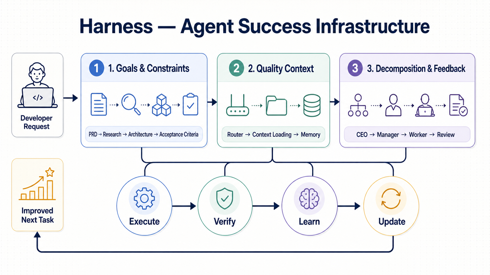

<p align="center">
  
  = 18">
  
  
</p>

<p align="center">
  
</p>

<h1 align="center">create-harness-vibe-coding</h1>
<p align="center">
  <b>让 AI agent 在真实仓库里先理解，再执行，最后验证。</b><br>
  <sub>面向 Claude Code、Codex 和 OpenCode 的 AI 编程工作流脚手架</sub>
</p>

<p align="center">
  <a href="README.md">English</a> ·
  <a href="https://github.com/LiWeny16/create-harness-vibe-coding">GitHub</a> ·
  <a href="https://www.npmjs.com/package/create-harness-vibe-coding">npm</a>
</p>

---

## 这是什么？

`create-harness-vibe-coding` 是一个 Node.js CLI。它为 AI 编程 agent 生成一套放在仓库里的工作契约，让 agent 在长任务中保持目标、上下文、边界、验证和记忆的一致。

它不是 prompt 集合，也不是模型本身。它解决的是另一个问题：同一个 agent 为什么第一轮看起来很好，第二轮却开始忘记决策、扩大修改范围、跳过验证？

## 一句话安装（已有项目推荐）

把下面这句话原样丢给正在使用的 Agent：

> 请根据 https://github.com/LiWeny16/create-harness-vibe-coding/blob/main/README-CN.md 安装 Harness 框架。

## 安装说明（Agent instruction）

Agent 读取本 README 后，按项目状态选择安装路径：

| 项目状态 | Agent 执行 |
|---|---|
| 新项目 | `npx create-harness-vibe-coding@latest my-project -y` |
| 已有项目 | `npx create-harness-vibe-coding@latest my-project . -y --on-conflict skip --json` |
| 已有 `Harness/` 且存在 `Harness/scripts/wf-update-check.mjs` | `node Harness/scripts/wf-update-check.mjs --json`，走更新流程，不要重复安装 |
| 已有 `Harness/` 但缺少 `Harness/scripts/wf-update-check.mjs` | `npx create-harness-vibe-coding@latest my-project . -y --on-conflict skip --json`。然后执行 `node Harness/scripts/wf-update-check.mjs --json` |
| 安装或更新完成 | `node Harness/scripts/validate-harness.mjs --strict` |

安装后的 instruction：先读取 `CLAUDE.md`、`AGENTS.md`、`Harness/SETUP.md` 和 `Harness/README.md`；遵守项目已有边界；先研究和计划，再修改代码；完成后运行测试、校验和审查，未验证不要声称完成。

用户不需要手动执行命令。把上面一句话交给 Agent，Agent 负责安装、冲突处理、校验和汇报。

## WF 命令怎么选

不确定时，直接用 `/wf-help`。它会返回完整命令表；复杂任务优先用 `/wf`，需要多人并行时用 `/wf-max`。

| 命令 | 什么时候用 | 它会做什么 | 示例 |
|---|---|---|---|
| `/wf <任务>` | 多文件、架构、迁移、风险较高或反复失败 | 研究 → 计划 → 实现 → 测试 → 审查 → 验证 → 复盘 | `/wf 重构支付模块并补齐测试` |
| `/wf-max <任务>` | 任务可拆成多个互不冲突的部分，需要最大并行度 | 在完整 WF 链路上增加 CEO → Manager → Worker 分工和并行波次 | `/wf-max 并行升级前端、后端和文档` |
| `/wf-auto` | 希望 Agent 持续自我优化，通过自适应探测选择 | 持续执行优化循环，每轮保留计划、证据和反馈 | `/wf-auto 优化这个项目的稳定性` |
| `/wf-auto-spark` | 需要外部灵感、竞品方向或长期路线图 | 搜索外部 spark，绑定 North Star 和里程碑，限制偏离范围 | `/wf-auto-spark 探索产品增长方向` |
| `/wf-review [重点]` | 需要第二意见、同行审查或上线前复核 | 优先调用可用 peer CLI；没有时使用独立 reviewer 角色，并按严重程度反馈 | `/wf-review 重点检查安全和数据丢失` |
| `/wf-learn` | 同类错误反复出现，或一次任务结束后要沉淀经验 | 汇总上下文、记忆和项目经验，形成下一次可复用规则 | `/wf-learn 总结这次返修原因` |
| `/wf-browser <任务>` | 浏览器冒烟、E2E、截图、表单或页面验证 | 使用真实浏览器完成操作并提供截图、追踪和验证证据 | `/wf-browser 验证登录和支付流程` |
| `/wf-readme <任务>` | README、安装文档、架构图或项目说明需要重写 | 保留事实，整理结构，补充安装和使用说明 | `/wf-readme 优化中文 README` |
| `/wf-update` | 已经安装 Harness，需要检查和应用框架更新 | 比较版本，自动处理安全变更，把语义冲突留给 Agent | `/wf-update` |
| `/wf-remove` | 需要卸载 Harness | 自动清理安全文件，保留用户数据，冲突文件先确认 | `/wf-remove` |
| `/wf-help` | 不知道该用哪个命令 | 只返回命令、用途和用法，不启动工作流 | `/wf-help` |

Claude Code 使用 `/wf-*`；Codex 使用对应的 `$wf-*`；OpenCode 使用已注册的命令或 Agent instruction。`/wf-auto` 和 `/wf-auto-spark` 是持续模式，启动前要给 Agent 清晰的目标、范围和验收标准。

常见场景可以这样起步：Web/API 先看正确性、安全、可靠性和验证；CLI/SDK 先看契约、兼容性、错误体验和文档；AI Agent 先看上下文质量、工具安全、评测和恢复；数据任务先看幂等性、失败恢复和可观测性。完整的自适应选择规则见 [WF-AUTO-ANGLES.md](Harness/WF-AUTO-ANGLES.md)。

## 它改变了什么？

| 没有工作契约 | 使用 Harness |
|---|---|
| 想到哪写到哪，靠 prompt 维持方向 | 目标 → 约束 → 验收条件，先定义完成边界 |
| Agent 读取整个仓库，关键信息被噪声淹没 | 路由按任务加载最小必要上下文 |
| 长任务中断后重新发现项目事实 | `PROGRESS.md`、任务胶囊和 Memory 保存接力信息 |
| 文件冲突靠人工临场判断 | 脚本先分类 create / skip / backup / overwrite / conflict |
| “看起来完成了”就结束 | 测试、校验器、审查和人工证据共同决定完成 |

模型不是唯一变量。给它一个有边界、有记忆、会自检的工作台，普通模型也能少忘事、少跑偏、少让你回来救火。

## 工作方式

Harness 把一次模糊请求变成一条可以追踪的路径：

```text
需求
 ↓
研究 → PRD → 架构 → 验收条件
 ↓
任务拆分 → 实现 → 测试 → 审查
 ↓
验证 → 学习 → 更新下一次任务
```

### 三个核心支柱

1. **目标与约束**：明确要解决什么、不能改什么、怎样算完成。
2. **上下文与记忆**：通过路由、按需加载和持久记忆，把正确的信息交给正确的 agent。
3. **分解与反馈**：把长任务切成有边界的小任务，每一步都留下验证和恢复入口。

## 架构图

<p align="center">
  <a href="docs/images/harness-architecture-light.png">
    
  </a>
  <br>
  <sub>
    Light 风格架构图 · <a href="docs/images/harness-architecture.drawio">下载可编辑 Drawio 源文件</a>
  </sub>
</p>

## 你会得到什么

| 目录或文件 | 作用 |
|---|---|
| `CLAUDE.md`、`AGENTS.md` | agent 启动入口和角色注册 |
| `Harness/README.md`、`Harness/MEMORY.md` | 按任务路由文档和资源 |
| `Harness/tasks/`、`Harness/PROGRESS.md` | 跨会话保存任务状态和接力信息 |
| `.claude/`、`.agents/`、`.codex/`、`.opencode/` | 不同 coding agent 的发现入口和配置 |
| `templates/common/`、`templates/optional/` | 可生成脚手架的声明式源文件 |
| `Harness/scripts/validate-harness.mjs` | 检查脚手架结构和 bootstrap 完整度 |

生成项目不会替你选择业务技术栈，也不会生成业务代码。你可以在 bootstrap 后自由选择 React、FastAPI 或其他技术栈。

## 稳定性、返修率与人工纠偏：别让 Agent 靠运气交付

先把话说满：Harness 不是更花哨的 prompt，而是给 Agent 装上刹车、仪表盘和黑匣子。没有工作契约，任务能不能收尾往往靠运气；有了 Harness，目标、边界、验证和返修都会留下证据。

数字也必须说清楚：当前仓库还没有发布受控 A/B 实验，因此不能把“稳定性提升 50%”冒充成真实结果。真正能对外说的数字，只有用同一个模型、同一个仓库、同一个任务、同一个预算跑出来的结果。基准对比使用 `bare-agent`、`harness-wf`、`harness-wf-max` 三种模式。

| 你真正关心的结果 | 没有 Harness | 使用 Harness | 可复现实测口径 |
|---|---|---|---|
| 稳定性 | 能跑就算完成，覆盖文件和漏验证常常事后才发现 | 写入前分类冲突，完成后必须经过测试、校验和审查 | 验证通过率、未授权覆盖次数、安全事故数 |
| 返修率 | 返工藏在下一轮 prompt 里，没人知道到底重做了多少 | 任务胶囊、验收条件和验证闭环把返修显性化 | 后续纠偏运行次数 ÷ 已完成任务数 |
| 人工纠偏 | 人类不断补上下文、盯进度、救火 | 人类只处理语义冲突和关键决策 | 每个任务的 `humanInterventions` |
| 中断恢复 | Agent 重新扫描仓库，决策和背景再来一遍 | `PROGRESS.md`、任务状态和持久记忆直接接力 | 恢复时间、重复发现时间 |
| 成本 | 前期省几分钟，后期可能付出几小时返工 | 有明确初始化成本，但时间、token 和验证开销可记录 | duration、tokenEstimate、验证命令 |

当前仓库能直接验证的是工程底座：冲突策略、写入边界、验证器、任务记录和 `humanInterventions` 指标已经存在；收益百分比要由 HarnessBench 实测产生。详见 [HarnessBench v0.1 评分设计](Harness/tasks/task-framework-metrics-and-entry-contract/PLAN.md#5-metrics-and-scoring)。

## 为什么人们会需要它

用三个真实顾虑来理解它：

| 顾虑 | 你担心什么 | Harness 怎么回答 |
|---|---|---|
| **嗔：损失厌恶** | 文件被覆盖、上下文漂移、任务返工 | 安全合并、冲突分类、写入边界、验证器 |
| **贪：效率杠杆** | 同一个 agent 反复解释，长任务总要重来 | 路由、任务胶囊、并行角色、持久记忆 |
| **痴：流程盲点** | 以为更好的 prompt 就能解决所有问题 | 把目标、约束、测试、审查和反馈变成可检查的流程 |

## 可选工作流

把需求直接交给 Agent：

> 请为当前 Harness 项目加入 `browser-e2e` 和 `ui-ux-review`，保留已有文件，完成后运行严格校验，并准确汇报发生了什么变化。

| 工作流 | 适合场景 |
|---|---|
| `browser-e2e` | 浏览器截图、追踪、冒烟测试 |
| `ui-ux-review` | 响应式、无障碍和界面打磨 |
| `ts-react-frontend` | TypeScript、React、Vite 项目 |
| `python-backend` | FastAPI、pytest 项目 |
| `github-pr-review` | PR diff 审查和 CI 证据 |

外部推荐只会记录到 `Harness/SETUP.md`，不会自动安装：

| 推荐 | 用途 | 来源 |
|---|---|---|
| `superpowers` | 社区 agent skills 和开发工作流 | [Superpowers](https://github.com/obra/Superpowers) |
| `caveman` | 简洁、低 token 的 agent 行为 | [Caveman](https://github.com/JuliusBrussee/caveman) |
| `agent-research` | 文献、产品、依赖和生态研究 | [agent-research-skills](https://github.com/lingzhi227/agent-research-skills) |
| `codegraph` | 代码图谱和仓库地图 | [Codegraph](https://github.com/colbymchenry/codegraph) |
| `grill-me` | 实现前对计划或设计做高压追问 | [Grill Me](https://github.com/mattpocock/skills/tree/main/skills/productivity/grill-me) |

## 验证

```bash
# 当前脚手架仓库
npm test

# 生成项目安全合并后
node Harness/scripts/validate-harness.mjs

# bootstrap 完成后或发布前
node Harness/scripts/validate-harness.mjs --strict
```

## 适配范围与体积

- 支持 Claude Code、Codex 和 OpenCode 的共享 Harness 工作流。
- Node.js ≥ 18。
- 运行时无额外依赖；CLI 依赖 `@clack/prompts` 和 `picocolors`。
- 生成的是工作基础设施，不是业务应用代码。

## 项目结构

```text
my-project/
├── CLAUDE.md / AGENTS.md       ← agent 入口
├── Harness/
│   ├── README.md               ← 文档路由器
│   ├── SETUP.md                ← bootstrap 指南
│   ├── MEMORY.md               ← 资源索引
│   ├── PROGRESS.md             ← 任务追踪器
│   ├── tasks/                  ← 任务胶囊
│   ├── research/               ← PRD 与研究模板
│   └── scripts/                ← 校验器
├── .claude/                    ← Claude Code 配置
├── .agents/skills/             ← Codex repo skills
├── .codex/                     ← Codex 配置
└── .opencode/                 ← OpenCode 配置
```

MIT © [LiWeny16](https://github.com/LiWeny16)
