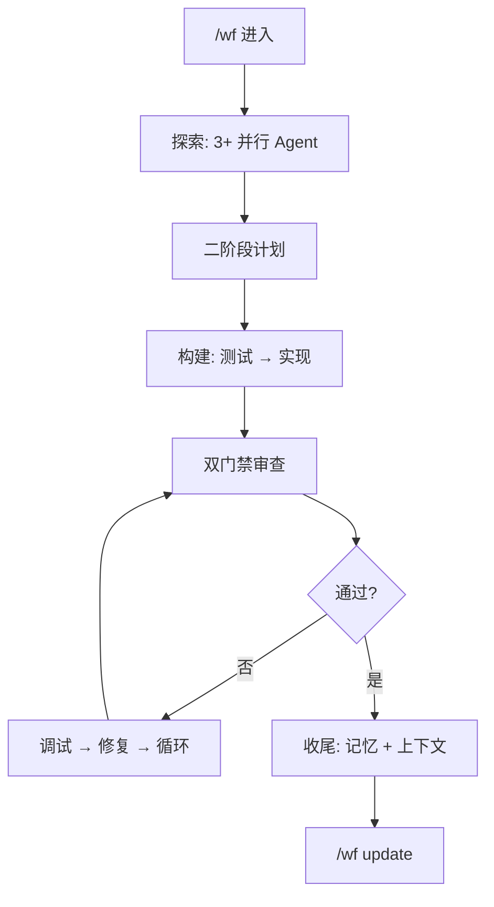

<p align="center">
  
  
  
  
</p>

<h1 align="center">create-harness-vibe-coding</h1>
<p align="center">
  <b>给你的 AI Agent 一个脚手架。一条命令，告别漂移。</b>
</p>

## 一条命令。搞定。

```bash
npx create-harness-vibe-coding@latest my-project
```

## 一句话交给你的 Agent

已有项目？**不用读文档。**把这句话贴给它。Agent 知道该做什么。

```text
请按照 https://github.com/zingspark/create-harness-vibe-coding 的 README 为当前项目配置 create-harness-vibe-coding；编辑前先询问 Agent-link 安装前置问题；新项目走 0-1 bootstrap，老项目或老架构升级先 dry-run，保留现有文件，只合并缺失的 Harness 规范，然后遵循 Harness/SETUP.md。
```

就两条路：
- **你来**：敲上面那行 `npx`
- **交给 Agent**：贴上面那句话

[English README](README.md)

---

## 你能得到什么

| 得到 | 效果 |
|------|------|
| `CLAUDE.md` + `Harness/README.md` | Agent 从路由器开始，不是读长篇大论 |
| `Harness/tasks/` + `Harness/PROGRESS.md` | 跨会话追踪任务进度 |
| `/wf` 工作流 + 心跳 | 长任务不迷路，失败自动恢复 |
| `/wf update` | 从 GitHub 拉取脚手架最新改进 |
| `subagent-orchestrator` | 并行 Agent 不打架 |
| `memory-master` + `context-master` | 从失败中学习，上下文快满时压缩 |
| PRD + 调研模板 | 先问"做什么""为什么"，再写代码 |
| 11 个内置 Agent | 调研、规划、架构、测试、构建、审查、调试、验证 |
| 架构文档 | 知道边界在哪里 |
| 上下文加载协议 | 每个子 Agent 只读它需要的文档 |
| `.claude/` 骨架 | Agent、Skill、命令、钩子——开箱即用 |

---

## 为什么需要它

太多 AI 编程项目在代码写烂之前就死了。Agent 跳过思考直接写代码，忘记昨天的决策，上下文塞满整个仓库。

| 没有脚手架 | 有了它 |
|------------|--------|
| 想法 → 代码。赌一把。 | 想法 → 调研 → PRD → 架构 → 构建 → 验证 |
| Agent 读完整个仓库 | 路由器只加载需要的那份文档 |
| 子 Agent 收到一句模糊的"修一下" | 上下文包：角色、边界、返回格式 |
| 漂移只到演示时才暴露 | 验证器标记缺失项 |
| 长任务卡死，上下文爆炸 | `/wf` 心跳 + 恢复循环 |
| 脚手架腐烂 | `/wf update` 从 GitHub 拉最新版 |

---

## 怎么工作的

```text
npx create-harness-vibe-coding@latest my-project
    ↓
Agent 读 Harness/SETUP.md
    ↓
路由器只加载任务需要的文档
    ↓
PRD → 调研 → 架构 → 第一个任务胶囊
    ↓
构建 → 测试 → 审查 → 验证 → 反馈
    ↓
/wf update 保持脚手架最新
```



---

## 怎么用

### 新项目

```bash
npx create-harness-vibe-coding@latest my-project
cd my-project
# Agent 读 Harness/SETUP.md。搞定。
```

### 已有项目——安全合并

```bash
# 先预览。永远先预览。
npx create-harness-vibe-coding@latest my-app . -y --dry-run

# 只补缺失。绝不覆盖已有文件。
npx create-harness-vibe-coding@latest my-app . -y --on-conflict skip
```

| 参数 | 作用 |
|------|------|
| `-y` | 跳过所有提示 |
| `--dry-run` | 预览——不写任何文件 |
| `--on-conflict skip` | 保留你的文件，只创建新的 |
| `--on-conflict backup` | 备份已有 → 写入新的 |
| `--on-conflict overwrite` | 直接覆盖（谨慎） |
| `--list-options` | 列出可选工作流 |
| `--with <ids>` | 按 id 添加工作流 |
| `--preset <name>` | 添加 `web-app` 或 `fullstack` 预设 |

### 可选工作流

```bash
npx create-harness-vibe-coding@latest my-app -y --with browser-e2e
npx create-harness-vibe-coding@latest my-app -y --preset web-app
```

| 工作流 | 场景 |
|--------|------|
| `browser-e2e` | 截图、链路追踪、冒烟测试 |
| `ui-ux-review` | 响应式、无障碍、视觉润色 |
| `ts-react-frontend` | TypeScript + React + Vite |
| `python-backend` | FastAPI、pytest |
| `github-pr-review` | PR diff 审查 + CI 证据 |

### Agent 安装前置问题

当你的 Agent 读到上面那句"一句话"后，它会在动文件前**最多问 3 个问题**：

- 已经有 `CLAUDE.md` 或 `AGENTS.md`？→ 只合并，不替换
- `docs/` 已被产品文档占用？→ 把脚手架放 `Harness/` 目录
- 什么技术栈？→ 安装匹配的可选工作流

文件已存在就**先问再动**。默认永远**保留已有**。

### 脚手架完成后

```text
"读 Harness/SETUP.md。把这个项目引导起来。"
"用 /wf 处理这个长迁移。"
"/wf update — 拉取最新脚手架改进。"
```

### 验证

```bash
npm test
node Harness/scripts/validate-harness.mjs
```

---

## 文件结构

```
my-project/
├── CLAUDE.md                  ← Agent 入口
├── AGENTS.md                  ← Agent 注册表
├── .gitignore
├── Harness/
│   ├── README.md              ← 文档路由器
│   ├── SETUP.md               ← 引导指南（初始化后可删除）
│   ├── MEMORY.md              ← 资源索引
│   ├── PROGRESS.md            ← 任务追踪
│   ├── WF.md / WF-MAX.md      ← 工作流模式
│   ├── tasks/                 ← 每任务胶囊
│   ├── research/              ← PRD + 调研模板
│   ├── memory/                ← 持久自学习
│   └── scripts/               ← 验证器
├── .claude/
│   ├── agents/               ← 11 个通用 Agent
│   ├── skills/               ← Harness 加载器
│   ├── commands/             ← /wf、/wf update
│   └── rules/                ← 通用编码规则
└── tests/
```

`Harness/` 放所有脚手架文档。`.claude/` 留在根目录——Claude Code 在这里发现 Agent、Skill 和命令。

---

## 足迹

| | |
|---|---|
| 运行时 | 无 |
| 依赖 | 2（`@clack/prompts`、`picocolors`） |
| Node | ≥ 18 |
| 生成代码 | 无——直到你选定技术栈 |

---

MIT © [zingspark](https://github.com/zingspark)
