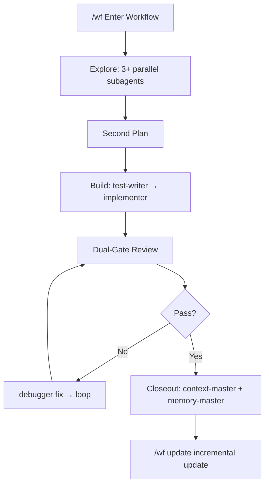

<p align="center">
  
  
  
  
</p>

<h1 align="center">create-harness-vibe-coding</h1>
<p align="center">
  <b>0-1 product harness scaffold for AI-assisted engineering.</b><br>
  <sub>Idea -> Research -> PRD -> Architecture -> Plan -> Build -> Verify -> Feedback.</sub>
</p>

## One Command

```bash
npx create-harness-vibe-coding@latest my-project
```

---

## For Agents

> Paste this into Claude Code, Codex, Cursor, Gemini CLI, or any coding agent.

```text
Follow the README at https://github.com/zingspark/create-harness-vibe-coding to configure this project with create-harness-vibe-coding; before editing, ask the Agent-link install intake questions; for a new project run the 0-1 bootstrap, and for an existing project or legacy architecture run a dry-run first, preserve existing files, merge only missing Harness guidance, then follow Harness/SETUP.md.
```

[README-CN.md](README-CN.md) (Chinese README)

---

| What You Get | Purpose |
|-------------|---------|
| `CLAUDE.md` + `Harness/README.md` | Thin root entry and dynamic doc router |
| `Harness/PROGRESS.md` + `Harness/tasks/` | Global task index and per-task progress capsules |
| `Harness/WF.md` + `/wf` | Long-task workflow: parallel explore, second-plan, build, review, verify, recover |
| `/wf update` | GitHub-based incremental scaffold update with checksum safety |
| `Harness/subagents.md` + `subagent-orchestrator` | Controller-led multi-agent orchestration with source-attributed methods |
| `memory-master` + `context-master` | Auto-triggered memory writing on repeated failures, and non-blocking context compression alerts |
| Research + PRD templates | Clarify idea, scope, non-goals, acceptance criteria |
| Research protocol | Route research agents, source search, and fallback tools |
| Built-in common agents | 11 agents: research, planning, architecture, testing, implementation, debugging, review, verification, memory, context |
| Harness architecture docs | Boundaries, ports, data flow, state machines |
| Dispatch protocol | Lightweight parallel-agent coordination without a scheduler |
| Extension contract | Keep stack-specific agents and skills compatible |
| Context-loading protocol | Inject only the right docs into each subagent |
| README optimizer skill | Optional README preservation, tables, and approved architecture diagrams |
| Skill-style loaders | `.claude/skills/*` route lifecycle, context, and build loops |
| Harness validator | Checks required files, agent/skill registrations, invariants |
| `.claude/` skeleton | Root runtime integration for Claude Code agents, skills, commands, and rules |

---

## Why This Exists

Most 0-1 AI coding projects fail before code quality matters:

| Without Harness | With This Scaffold |
|---|---|
| Idea jumps straight to code | Lifecycle forces research, PRD, and scope |
| Agent reads too much context | Docs router loads only the needed harness file |
| Subagents get vague prompts | Context-loading packs define role, boundaries, and return format |
| Process drift is invisible | Validator checks core harness readiness |
| Architecture drifts silently | Ports, data-flow, and state docs mark boundary changes |
| Tests come after implementation | Workflow requires failing test or manual check first |
| Long tasks stall after failures | `/wf` adds heartbeat, recovery loop, auto memory-master at 3 failures |
| Context bloats over long sessions | `context-master` gives non-blocking compression alerts at ~85% window |
| Scaffold rots after generation | `/wf update` pulls latest improvements from GitHub with checksum safety |

---

## How It Works

```text
npx scaffold
-> Claude reads Harness/SETUP.md
-> Harness router selects only needed harness docs
-> PRD/research/architecture are filled
-> First task capsule created at Harness/tasks/<id>/
-> First vertical slice is built, tested, reviewed, verified, and fed back
-> Validator catches missing project facts before release
-> /wf update pulls latest scaffold improvements from GitHub
```

### Harness idea

The scaffold does not prebuild business code. It gives agents a compact process for turning an idea into a verified product slice.

### Harness Workflow



---

## What's Inside

```
my-project/
├── CLAUDE.md              ← Short startup rules + context discipline
├── AGENTS.md              ← Coding agent entry
├── README.md              ← Project build/test/git/run notes
├── .gitignore
├── Harness/
│   ├── README.md          ← Dynamic doc router
│   ├── SETUP.md           ← Temporary init guide (delete after setup)
│   ├── MEMORY.md          ← Cross-session resource index
│   ├── PROGRESS.md        ← Global task index and cross-task decisions
│   ├── PLAN.md            ← Deprecated stub → see PROGRESS.md + tasks/
│   ├── .harness-version   ← Scaffold version + file checksums
│   ├── WF.md              ← Long-task workflow and recovery loop
│   ├── lifecycle.md       ← 0-1 product flow
│   ├── subagents.md       ← Controller-led subagent orchestration
│   ├── context-loading.md ← Subagent context packs
│   ├── dispatch.md        ← Lightweight parallel-agent protocol
│   ├── extension.md       ← Stack-specific agent/skill contract
│   ├── architecture.md    ← Layer rules, components, ADRs
│   ├── agent-workflow.md  ← TDD loop, subagent roles, write sets
│   ├── data-flow.md       ← Event lifecycle: normal + failure paths
│   ├── state-machines.md  ← State enums, transition tables, guards
│   ├── domain/
│   │   └── ports.md       ← Port contracts: pre/postconditions, errors
│   ├── features/
│   │   └── _template.md   ← Feature doc template
│   ├── tasks/
│   │   ├── _template/     ← Task capsule template (copy for new tasks)
│   │   └── <task-id>/     ← Per-task PROGRESS.md + PLAN.md + artifacts
│   ├── research/
│   │   ├── README.md
│   │   ├── PRD.md
│   │   └── research-results.md
│   ├── memory/
│   │   ├── tool-usage-reflections.md
│   │   ├── user-corrections-preferences.md
│   │   └── agent-lessons-patterns.md
│   ├── workflows/         ← Optional workflow docs
│   └── scripts/
│       └── validate-harness.mjs
├── .claude/
│   ├── settings.json     ← Base permissions
│   ├── agents/           ← 11 common agents + stack-specific
│   ├── skills/           ← Harness skills + wf-update + stack-specific
│   ├── commands/
│   │   ├── wf.md          ← /wf — enter workflow mode
│   │   └── update.md      ← /wf update — GitHub-based scaffold update
│   ├── hooks/            ← Configure automation after stack choice
│   └── rules/ecc/
│       └── common.md     ← Universal coding rules
└── tests/                ← Your test suite goes here
```

`Harness/` is the default home for harness-owned docs, state, memory, workflows, and validation. The root `.claude/` directory remains at the project root because Claude Code discovers agents, skills, commands, settings, hooks, and rules there.

---

## Ecosystem Compatibility

| Platform | Fit |
|----------|-----|
| Claude Code | Native `CLAUDE.md`, `.claude/settings.json`, agents, skills, hooks |
| Codex / Cursor / Gemini CLI | Works as docs-first process scaffold |
| ECC / Superpowers / toolboxes | Optional source for stack-specific agents, skills, and rules |

---

## Usage

### Human

```bash
# Interactive mode — prompts for project name and directory
npx create-harness-vibe-coding@latest
```

### Existing Project

The scaffold is designed to be added to an existing repository without silently replacing project files.

There are two installation paths:

- **npx install**: deterministic scaffold writes with explicit conflict policy. Use this when you want predictable files and a clear dry-run plan.
- **Agent-link install**: paste the one-sentence prompt above into Claude Code, Codex, Cursor, Gemini CLI, or another coding agent. This path is more flexible: the agent should read this README, inspect the existing project, run or emulate a dry-run, and propose a minimal migration plan before editing.

Agent-link install intake, asked before editing:

Ask only questions that affect writes, architecture, security, or workflow. Ask at most three blocking questions up front, record safe defaults for the rest, and ask follow-ups only when that choice becomes active.

| Topic | Ask When | Default If Unanswered |
| --- | --- | --- |
| Root agent entry | `CLAUDE.md`, `AGENTS.md`, `.claude/`, or other agent entry files already exist | Preserve files; ask before merging the Harness entry contract |
| Harness location | `docs/` is already used for GitHub Pages, product docs, or generated docs | Use root `Harness/`; do not write harness docs into `docs/` |
| README ownership | root `README.md` is a public product page, package docs, or heavily customized | Preserve existing README and propose a minimal Development section |
| README optimization | existing README is stale, sparse, missing command tables, or the user asks for diagrams/polished docs | Offer `readme-optimizer`; default to append-only Development notes until the user approves a structure pass or full rewrite |
| Extensions | ECC, Superpowers, custom rules, or stack-specific skills may be useful | Recommend first; install only after user approval |
| Skills | stack is known and optional skills could improve testing, frontend, backend, review, or browser evidence | Install 1-2 relevant skills only after user approval |
| CI/CD | CI config exists or the project lacks a test/build gate | Document existing commands first; add CI/CD only after user approval |
| Verification depth | browser-visible, API, database, auth, payment, or deployment behavior is affected | Require real command evidence; require browser/API evidence when relevant |
| Memory/privacy | repo contains sensitive domain data, customer data, secrets, or private workflows | Enable memory index only; never record secrets or private data |
| Branch/worktree | project has uncommitted changes, risky migration, or parallel implementation lanes | Preserve current worktree; propose branch/worktree before broad edits |
| Package manager/stack | multiple package managers, monorepo apps, or unclear stack boundaries exist | Ask which workspace/app is in scope before writing |

If `CLAUDE.md` already exists, the agent must tell the user it is the root agent entry contract and ask for confirmation before refactoring, merging, backing up, or replacing it. The correct outcome is a user-approved merge that preserves project-specific rules while adding the Harness startup, memory, router, workflow, and subagent orchestration contract.

```bash
# Preview the write plan first. No files or directories are created.
npx create-harness-vibe-coding@latest my-app . -y --dry-run

# Preserve existing files and add only missing harness files.
npx create-harness-vibe-coding@latest my-app . -y --on-conflict skip
```

By default, conflicts fail before writing. This protects existing `CLAUDE.md`, `AGENTS.md`, `README.md`, `.claude/`, `.gitignore`, project docs, and scripts from accidental replacement.

| Conflict mode | Meaning | Risk |
|---------------|---------|------|
| `fail` | Default. Stop if a target file already exists. | Safest for existing projects; requires a follow-up decision. |
| `skip` | Keep existing files and create only missing files. | Existing root entries may need manual links to new `Harness/` docs or workflows. |
| `backup` | Rename the existing file to `<name>.harness-backup`, then write the scaffold file. | Review backups before deleting; repeated runs may need cleanup. |
| `overwrite` | Replace existing files with scaffold versions. | Destructive. Use only after reviewing `--dry-run` output or with explicit approval. |

Recommended bootstrap for agents:

```bash
node bin/create-harness-vibe-coding.js my-app . -y --dry-run
node bin/create-harness-vibe-coding.js my-app . -y --on-conflict skip
node Harness/scripts/validate-harness.mjs
```

After files are installed, agents must follow `Harness/SETUP.md` before normal project work. `CLAUDE.md` only points to the required Harness routers; setup details belong in `Harness/SETUP.md`.

If `AGENTS.md` already exists, the agent must ask for user consent before merging or replacing it. `AGENTS.md` is part of the root agent entry contract, just like `CLAUDE.md`.

Development commands, build scripts, git conventions, and release process belong in root `README.md`. Code architecture belongs in `Harness/architecture.md` or feature docs, not in `CLAUDE.md`.

### Agent / CI/CD

Agents and automation can skip all prompts with `-y`:

```bash
# One-liner with defaults (project name = my-vibe-project)
npx create-harness-vibe-coding@latest -y

# Named project, auto directory
npx create-harness-vibe-coding@latest my-app -y

# Named project, explicit directory
npx create-harness-vibe-coding@latest my-app ./dist/my-app -y

# CI-safe existing-project preview
npx create-harness-vibe-coding@latest my-app . -y --dry-run

# CI-safe existing-project add without replacing files
npx create-harness-vibe-coding@latest my-app . -y --on-conflict skip
```

| Flag | Purpose |
|------|---------|
| `-y`, `--yes` | Skip all prompts. Uses positional args or defaults. |
| `--dry-run` | Print the planned creates, skips, backups, overwrites, and conflicts without writing. |
| `--on-conflict <mode>` | Choose `fail`, `skip`, `backup`, or `overwrite` when files already exist. |
| `--list-options` | Print the optional workflow catalog and presets. |
| `--with <ids>` | Add optional workflows by comma-separated id. |
| `--without <ids>` | Remove optional workflows selected by `--preset` or `--with`. |
| `--preset <name>` | Add a named workflow preset such as `web-app` or `fullstack`. |
| `-h`, `--help` | Print usage and exit. |

> [!TIP]
> Agents should always pass `-y` to avoid hanging on interactive prompts.
> If the agent needs to discover the CLI surface first, run with `--help` and `--list-options`.

### Optional Workflows

Optional workflows are local template assets selected explicitly at generation time. They do not install package dependencies or fetch a remote marketplace.

```bash
# Show available optional workflow ids and presets
npx create-harness-vibe-coding@latest --list-options

# Add individual workflows
npx create-harness-vibe-coding@latest my-app -y --with browser-e2e,ts-react-frontend

# Add a preset for common web app work
npx create-harness-vibe-coding@latest my-app -y --preset web-app

# Add a broader frontend/backend/PR-review preset
npx create-harness-vibe-coding@latest my-app -y --preset fullstack

# Trim a preset without restating every selected workflow
npx create-harness-vibe-coding@latest my-app -y --preset fullstack --without github-pr-review
```

Built-in optional workflow ids:

| Workflow | Use when |
|----------|----------|
| `browser-e2e` | Browser smoke tests, screenshots, traces, and UI evidence. |
| `ui-ux-review` | Screenshot-driven responsive, accessibility, and polish review. |
| `github-pr-review` | PR diff, checks, review findings, and CI evidence. |
| `python-backend` | Python API/backend work with unittest or pytest verification. |
| `ts-react-frontend` | TypeScript React work with typecheck, component tests, build, and browser smoke. |

Presets:

| Preset | Includes |
|--------|----------|
| `web-app` | `ts-react-frontend`, `browser-e2e`, `ui-ux-review` |
| `fullstack` | `ts-react-frontend`, `python-backend`, `browser-e2e`, `github-pr-review` |

### WF Mode

For long, difficult, multi-file, multi-agent, or repeated-failure tasks. Enter by typing `/wf`, `wf mode`, `workflow mode`, or `wk mode`.

```text
/wf — triggers the full Ralph-style harness loop:
  Intake (95% confidence gate)
  -> 3+ parallel read-only subagents (planner + architect + researcher)
  -> Synthesis + second plan → writes to Harness/tasks/<id>/PLAN.md
  -> test-writer → implementer → reviewers → verifier
  -> Failed? debugger → review → verify → loop
  -> Closeout: context-master + memory-master consolidate knowledge
```

| Phase | What happens | Heartbeat |
|-------|-------------|-----------|
| Intake | State goal, confidence, risks, write boundaries | Update before dispatching |
| Explore | 3-5 parallel read-only subagents | After each subagent return |
| Second Plan | Synthesize findings into `tasks/<id>/PLAN.md` | After plan written |
| Build | `test-writer` → `implementer` serial lane | Before/after long commands |
| Review | Spec review, then code-quality review | After each review gate |
| Verify | Run declared checks, record evidence | After each verification |
| Recover | `debugger` → fix → review → verify → loop | After each failure |
| Close | `context-master` extraction → `memory-master` consolidation → archive | Final heartbeat |

WF mode also auto-dispatches:
- **`memory-master`** at 3 same-class failures (records pattern before asking user)
- **`context-master`** at ~85% context window (non-blocking compression suggestion)
- **`context-master` + `memory-master`** at closeout (extract + persist session knowledge)

```bash
# Tell the agent to use WF mode
"Use /wf for this migration."
"This is a long task — enter wf mode."
"wf mode — help me refactor the auth layer."
```

### WF Update

Check for scaffold updates from GitHub and apply them incrementally with checksum safety.

```bash
# Check available updates without applying
/wf update --check

# Full update with safe incremental apply
/wf update
```

**How it works:**

1. Reads `Harness/.harness-version` — gets local version + 54 file SHA-256 checksums
2. Fetches latest template files from `raw.githubusercontent.com/zingspark/create-harness-vibe-coding/main/templates/common/`
3. Compares checksums file-by-file against stored values
4. Classifies each file into three tiers:

| Tier | Policy | Examples |
|------|--------|----------|
| **SAFE** | Overwrite if local checksum matches stored (unmodified) | `Harness/WF.md`, `.claude/agents/*.md`, all skills |
| **PRESERVE** | Never touch | `Harness/PROGRESS.md`, `Harness/tasks/**`, `Harness/memory/**`, root `README.md` |
| **MERGE** | Overwrite if unmodified; report and skip if user-modified | `CLAUDE.md`, `Harness/MEMORY.md`, `Harness/README.md` |

5. Reports: `updated/N, merge/N, created/N, skipped/N`
6. Updates `.harness-version` checksums after applying

**Auto-check on session start:** When `Harness/.harness-version` has `autoCheck: true`, the agent runs a non-blocking `update --check` (10s timeout). If an update is available, it notifies without blocking the current task. Set `autoCheck: false` to disable.

**Offline behavior:** If GitHub is unreachable, the update check exits cleanly. All other harness features work without network.

### Verification

```bash
# Run repository tests
npm test

# Confirm optional workflow catalog output
node bin/create-harness-vibe-coding.js --list-options

# After generating a project, validate the harness from that project root
node Harness/scripts/validate-harness.mjs
```

The harness validator checks scaffold consistency. It is not a full React, Playwright, Chrome DevTools Protocol, or browser matrix test suite.

### After scaffolding, tell Claude:

```
"Read Harness/SETUP.md. Bootstrap this project from idea to first vertical slice."
"Read Harness/SETUP.md. This is a React TypeScript SaaS idea. Clarify PRD first, then plan the first slice."
"Read Harness/SETUP.md. This is a Python data product. Research the stack, define the MVP, then create a task capsule."
"Use /wf for this long migration. Explore first, make a second plan, then implement, review, verify, and recover with heartbeat updates."
"/wf update --check — check if the scaffold has been improved since last generation."
"/wf update — pull the latest harness improvements from GitHub safely."
```

---

## Footprint

| Metric | Value |
|--------|-------|
| Runtime after scaffold | none |
| Dependencies | 2 (`@clack/prompts`, `picocolors`) |
| Node requirement | >= 18 |
| Generated code | none until the product stack is chosen |

---

## Contributing

PRs welcome. The template docs live in `templates/common/` — edit them to change what gets scaffolded.

---

## License

MIT © [zingspark](https://github.com/zingspark)
