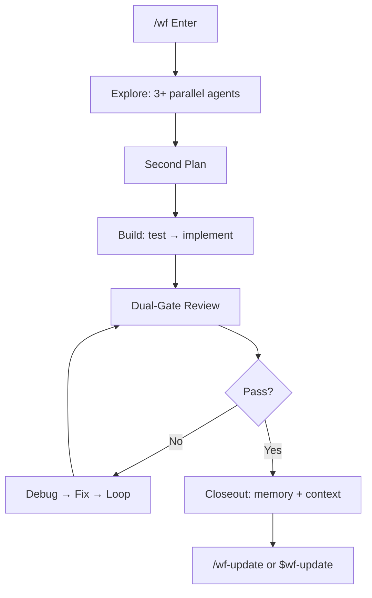

<p align="center">
  
  
  
  
</p>

<h1 align="center">create-harness-vibe-coding</h1>
<p align="center">
  <b>A harness for your AI agent. One scaffold. Zero drift.</b><br>
</p>

## One Command. Done.

```bash
npx create-harness-vibe-coding@latest my-project
```

## Your Agent Knows What to Do

Already have a project? **Don't read the docs**. Paste this sentence. Your agent handles the rest.

```text
Read and follow https://github.com/zingspark/create-harness-vibe-coding exactly to configure this project with create-harness-vibe-coding.
```

That's it. Two paths into the harness — you type `npx`, or your agent reads the sentence.

Chinese README: [README-CN.md](README-CN.md)

---

## What You Get

| You get | So your agent |
|---------|---------------|
| `CLAUDE.md` + `Harness/README.md` | Starts with a router, not a novel |
| `Harness/tasks/` + `Harness/PROGRESS.md` | Tracks work across sessions |
| `/wf` / `$wf` workflow + heartbeat | Finishes long tasks without getting lost |
| `/wf-update` / `$wf-update` | Pulls scaffold fixes from GitHub |
| `subagent-orchestrator` | Runs parallel agents without collision |
| `memory-master` + `context-master` | Learns from failures, compresses when full |
| PRD + Research templates | Asks "what" and "why" before coding |
| 11 built-in agents | Research, plan, architect, test, build, review, debug, verify |
| Architecture docs | Knows where boundaries live |
| Context-loading protocol | Loads only the docs each agent needs |
| `.claude/` + `.agents/skills/` | Claude Code and Codex skill adapters over the same Harness docs |

---

## Why This Exists

Most AI coding projects fail before anyone writes a line of bad code. The agent jumps straight to implementation, drifts from intent, forgets yesterday's decisions, and bloats its context with the whole repo.

| Without harness | With harness |
|-----------------|--------------|
| Idea → code. Hope. | Idea → Research → PRD → Architecture → Build → Verify |
| Agent reads everything | Router loads the one doc it needs |
| Subagent gets a vague "fix it" | Context pack: role, boundary, return format |
| Drift invisible until demo | Validator flags missing pieces |
| Long task stalls, context explodes | `/wf` heartbeat + recovery loop |
| Scaffold rots | `/wf-update` or `$wf-update` pulls latest from GitHub |

---

## How It Works

```text
npx create-harness-vibe-coding@latest my-project
    ↓
Agent reads Harness/SETUP.md
    ↓
Router loads only what the task needs
    ↓
PRD → Research → Architecture → first task capsule
    ↓
Build → Test → Review → Verify → Feedback
    ↓
/wf-update or $wf-update keeps the harness current
```



---

## Usage

### New project

```bash
npx create-harness-vibe-coding@latest my-project
cd my-project
# Your agent reads Harness/SETUP.md. Done.
```

### Install or Upgrade Path

Before writing, the agent must identify which path applies:

| Project state | Required action |
|---------------|-----------------|
| Empty or new project | Run the scaffold, then follow `Harness/SETUP.md` for 0-1 bootstrap |
| Existing project, no `Harness/` | Scan project facts first, run `--dry-run`, preserve existing files, merge only missing Harness guidance |
| Legacy architecture or older project docs | Treat existing code/docs as source of truth, dry-run first, then use `Harness/SETUP.md` to fill facts from observed project reality |
| Existing `Harness/` | Do not use `npx` as an updater; ask whether to run `/wf-update`, `$wf-update`, `node Harness/scripts/wf-update-check.mjs`, keep untouched, or remove/reinstall after approval |

Root scan must include top-level files, `CLAUDE.md`, `AGENTS.md`, `.claude/`, `.agents/`, `.codex/`, `Harness/`, package files, CI files, app entry points, test/build commands, existing docs, and already-installed skills/plugins/rules. Use that scan before recommending optional capabilities so you do not suggest duplicates.

### Existing project — safe merge

```bash
# Machine-readable preview first. Always.
npx create-harness-vibe-coding@latest my-app . -y --dry-run --json

# Add only what's missing. Never overwrite.
npx create-harness-vibe-coding@latest my-app . -y --on-conflict skip --json
```

The JSON output is the agent's install report: `scan` replaces hand-written root probes, `plan.create` is script-owned, and `agent.aiMergeRequired` is the only list that needs semantic AI review. Do not read package source or templates unless `agent.aiMergeRequired` names a conflicting file.

`npx` is an install and safe-merge entry, not an update engine for an already installed Harness. Once `Harness/` exists, use `/wf-update` in Claude Code, `$wf-update` in Codex, or `node Harness/scripts/wf-update-check.mjs`; root entry conflicts such as `CLAUDE.md`, `AGENTS.md`, `.claude/`, `.agents/`, `.codex/`, and local Harness docs need agent-mediated merge decisions.

| Flag | Does |
|------|------|
| `-y` | Skip prompts |
| `--dry-run` | Preview — no writes |
| `--on-conflict skip` | Keep your files, add only new ones |
| `--on-conflict backup` | Rename existing → write new |
| `--on-conflict overwrite` | Replace (destructive) |
| `--list-options` | Show optional workflows |
| `--with <ids>` | Add workflow by id |
| `--recommend <ids>` | Record recommendation-only external capabilities |
| `--preset <name>` | Add `web-app` or `fullstack` preset |

Without `-y`, interactive mode offers checkbox selection for optional workflows and external recommendations.

### Optional workflows

```bash
npx create-harness-vibe-coding@latest my-app -y --with browser-e2e
npx create-harness-vibe-coding@latest my-app -y --preset web-app
npx create-harness-vibe-coding@latest my-app -y --recommend superpowers,codegraph
```

| Workflow | For |
|----------|-----|
| `browser-e2e` | Screenshots, traces, smoke tests |
| `ui-ux-review` | Responsive, a11y, polish |
| `ts-react-frontend` | TypeScript + React + Vite |
| `python-backend` | FastAPI, pytest |
| `github-pr-review` | PR diff review + CI evidence |

External recommendations are recorded in `Harness/SETUP.md` but not installed automatically:

| Recommendation | For | Source |
|----------------|-----|--------|
| `superpowers` | Community skill registry and agent workflows | <https://github.com/obra/Superpowers> |
| `caveman` | Terse, low-token agent behavior and memory compression | <https://github.com/JuliusBrussee/caveman> |
| `agent-research` | Research-agent skills for literature, product, dependency, and ecosystem investigation | <https://github.com/lingzhi227/agent-research-skills> |
| `codegraph` | Code graph or repository-map tooling | <https://github.com/colbymchenry/codegraph> |

These are links for the user's agent to evaluate. The scaffold does not maintain third-party install steps; it only records selected recommendations after checking what is already installed.

### Agent-link intake

When your agent reads the one-sentence prompt above, it should get the machine-readable install report before asking broad questions:

```bash
npx create-harness-vibe-coding@latest my-app . -y --dry-run --json
```

Use `scan.markers` instead of manual top-level probes. Ask **at most 3 blocking questions** before touching files. Files in `plan.create` are handled by the script; only files in `agent.aiMergeRequired` need AI comparison and user-supervised merge decisions.

Ask these only when they affect writes:

- If `CLAUDE.md` or `AGENTS.md` already exists, should missing Harness guidance be merged, kept separate, or skipped?
- If `Harness/` already exists, should the agent run update/dry-run, merge missing files, keep it untouched, or remove/reinstall after approval?
- Which optional capabilities should be enabled, after excluding capabilities already installed: local workflows (`browser-e2e`, `ui-ux-review`, `ts-react-frontend`, `python-backend`, `github-pr-review`) and recommendation-only external links (`Superpowers`, `Caveman`, `agent research`, `code graph`)?

Harness docs always live in root `Harness/`; do not route Harness files through `docs/`. If a file already exists, the agent asks first. The default is always **preserve**.

### After scaffolding

```text
"Read Harness/SETUP.md. Bootstrap this project."
"Use /wf for this migration."          # Claude Code
"Use $wf for this migration."          # Codex
"/wf-update" or "$wf-update"           # pull latest harness improvements
```

### Verify

```bash
# In this package repo
npm test

# In a generated project after bootstrap
node Harness/scripts/validate-harness.mjs --strict
```

---

## Inside

```
my-project/
├── CLAUDE.md                  ← Agent entry
├── AGENTS.md                  ← Agent registry
├── .gitignore
├── Harness/
│   ├── README.md              ← Doc router
│   ├── SETUP.md               ← Bootstrap guide (delete after init)
│   ├── MEMORY.md              ← Resource index
│   ├── PROGRESS.md            ← Task tracker
│   ├── WF.md / WF-MAX.md      ← Workflow modes
│   ├── tasks/                 ← Per-task capsules
│   ├── research/              ← PRD + research templates
│   ├── memory/                ← Durable self-learning
│   └── scripts/               ← Validator
├── .claude/
│   ├── agents/               ← 11 common agents
│   ├── skills/               ← Claude Code skill commands
│   └── rules/                ← Universal coding rules
├── .agents/
│   └── skills/               ← Codex repo skills
├── .codex/                    ← Codex config
└── tests/
```

`Harness/` holds all harness docs. Tool-discovery folders stay at root: `.claude/` for Claude Code, `.agents/skills/` for Codex repo skills, and `.codex/` for Codex config. Runtime hooks are absent by default; only `/wf-auto` may opt into a bounded tick hook.

---

## Footprint

| | |
|---|---|
| Runtime | None |
| Dependencies | 2 (`@clack/prompts`, `picocolors`) |
| Node | ≥ 18 |
| Generated code | None until you pick a stack |

---

MIT © [zingspark](https://github.com/zingspark)
