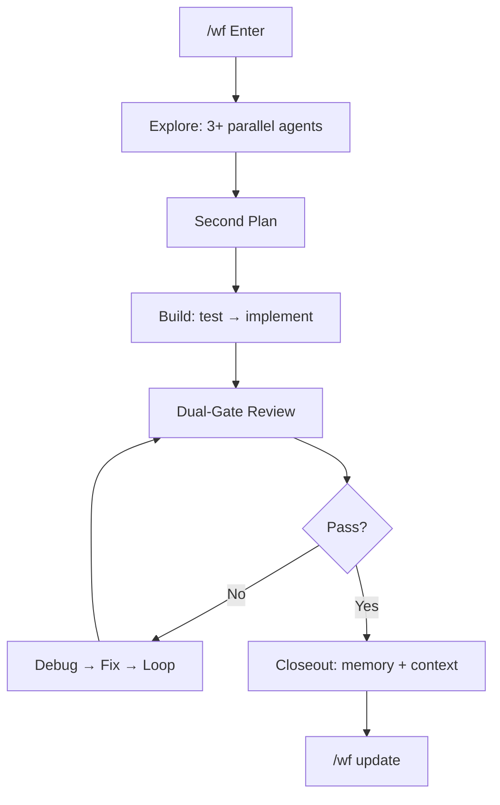

<p align="center">
  
  
  
  
</p>

<h1 align="center">create-harness-vibe-coding</h1>
<p align="center">
  <b>A harness for your AI agent. One scaffold. Zero drift.</b><br>
</p>

## One Command. Done.

```bash
npx create-harness-vibe-coding@latest my-project
```

## Your Agent Knows What to Do

Already have a project? **Don't read the docs**. Paste this sentence. Your agent handles the rest.

```text
Follow the README at https://github.com/zingspark/create-harness-vibe-coding to configure this project with create-harness-vibe-coding; before editing, ask the Agent-link install intake questions; for a new project run the 0-1 bootstrap, and for an existing project or legacy architecture run a dry-run first, preserve existing files, merge only missing Harness guidance, then follow Harness/SETUP.md.
```

That's it. Two paths into the harness — you type `npx`, or your agent reads the sentence.

Chinese README: [README-CN.md](README-CN.md)

---

## What You Get

| You get | So your agent |
|---------|---------------|
| `CLAUDE.md` + `Harness/README.md` | Starts with a router, not a novel |
| `Harness/tasks/` + `Harness/PROGRESS.md` | Tracks work across sessions |
| `/wf` workflow + heartbeat | Finishes long tasks without getting lost |
| `/wf update` | Pulls scaffold fixes from GitHub |
| `subagent-orchestrator` | Runs parallel agents without collision |
| `memory-master` + `context-master` | Learns from failures, compresses when full |
| PRD + Research templates | Asks "what" and "why" before coding |
| 11 built-in agents | Research, plan, architect, test, build, review, debug, verify |
| Architecture docs | Knows where boundaries live |
| Context-loading protocol | Loads only the docs each agent needs |
| `.claude/` skeleton | Agents, skills, commands, hooks — ready to go |

---

## Why This Exists

Most AI coding projects fail before anyone writes a line of bad code. The agent jumps straight to implementation, drifts from intent, forgets yesterday's decisions, and bloats its context with the whole repo.

| Without harness | With harness |
|-----------------|--------------|
| Idea → code. Hope. | Idea → Research → PRD → Architecture → Build → Verify |
| Agent reads everything | Router loads the one doc it needs |
| Subagent gets a vague "fix it" | Context pack: role, boundary, return format |
| Drift invisible until demo | Validator flags missing pieces |
| Long task stalls, context explodes | `/wf` heartbeat + recovery loop |
| Scaffold rots | `/wf update` pulls latest from GitHub |

---

## How It Works

```text
npx create-harness-vibe-coding@latest my-project
    ↓
Agent reads Harness/SETUP.md
    ↓
Router loads only what the task needs
    ↓
PRD → Research → Architecture → first task capsule
    ↓
Build → Test → Review → Verify → Feedback
    ↓
/wf update keeps the harness current
```



---

## Usage

### New project

```bash
npx create-harness-vibe-coding@latest my-project
cd my-project
# Your agent reads Harness/SETUP.md. Done.
```

### Existing project — safe merge

```bash
# Preview first. Always.
npx create-harness-vibe-coding@latest my-app . -y --dry-run

# Add only what's missing. Never overwrite.
npx create-harness-vibe-coding@latest my-app . -y --on-conflict skip
```

| Flag | Does |
|------|------|
| `-y` | Skip prompts |
| `--dry-run` | Preview — no writes |
| `--on-conflict skip` | Keep your files, add only new ones |
| `--on-conflict backup` | Rename existing → write new |
| `--on-conflict overwrite` | Replace (destructive) |
| `--list-options` | Show optional workflows |
| `--with <ids>` | Add workflow by id |
| `--preset <name>` | Add `web-app` or `fullstack` preset |

### Optional workflows

```bash
npx create-harness-vibe-coding@latest my-app -y --with browser-e2e
npx create-harness-vibe-coding@latest my-app -y --preset web-app
```

| Workflow | For |
|----------|-----|
| `browser-e2e` | Screenshots, traces, smoke tests |
| `ui-ux-review` | Responsive, a11y, polish |
| `ts-react-frontend` | TypeScript + React + Vite |
| `python-backend` | FastAPI, pytest |
| `github-pr-review` | PR diff review + CI evidence |

### Agent-link intake

When your agent reads the one-sentence prompt above, it asks **at most 3 questions** before touching files:

- Is `CLAUDE.md` or `AGENTS.md` already there? → merge, don't replace
- Is `docs/` used for product docs? → puts harness in `Harness/`, not `docs/`
- What stack? → installs matching optional workflows

If a file already exists, the agent asks first. The default is always **preserve**.

### After scaffolding

```text
"Read Harness/SETUP.md. Bootstrap this project."
"Use /wf for this migration."
"/wf update — pull latest harness improvements."
```

### Verify

```bash
npm test
node Harness/scripts/validate-harness.mjs
```

---

## Inside

```
my-project/
├── CLAUDE.md                  ← Agent entry
├── AGENTS.md                  ← Agent registry
├── .gitignore
├── Harness/
│   ├── README.md              ← Doc router
│   ├── SETUP.md               ← Bootstrap guide (delete after init)
│   ├── MEMORY.md              ← Resource index
│   ├── PROGRESS.md            ← Task tracker
│   ├── WF.md / WF-MAX.md      ← Workflow modes
│   ├── tasks/                 ← Per-task capsules
│   ├── research/              ← PRD + research templates
│   ├── memory/                ← Durable self-learning
│   └── scripts/               ← Validator
├── .claude/
│   ├── agents/               ← 11 common agents
│   ├── skills/               ← Harness loaders
│   ├── commands/             ← /wf, /wf update
│   └── rules/                ← Universal coding rules
└── tests/
```

`Harness/` holds all harness docs. `.claude/` stays at root — that's where Claude Code discovers agents, skills, and commands.

---

## Footprint

| | |
|---|---|
| Runtime | None |
| Dependencies | 2 (`@clack/prompts`, `picocolors`) |
| Node | ≥ 18 |
| Generated code | None until you pick a stack |

---

MIT © [zingspark](https://github.com/zingspark)
