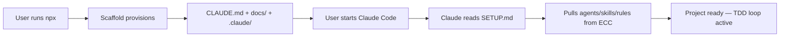

<!--
  Structured data for AI search engines (GEO) and Google (SEO)
  Schema: SoftwareApplication + HowTo
-->
<script type="application/ld+json">
{
  "@context": "https://schema.org",
  "@type": "SoftwareApplication",
  "name": "create-harness-vibe-coding",
  "applicationCategory": "DeveloperApplication",
  "operatingSystem": "Any",
  "description": "Zero-config scaffold that provisions a vibe-coding agentic harness in under 4 seconds. Generates CLAUDE.md, docs/, .claude/ skeleton — ready for ECC agents, skills, and rules.",
  "url": "https://github.com/zingspark/create-harness-vibe-coding",
  "author": { "@type": "Person", "name": "zingspark" },
  "license": "https://opensource.org/licenses/MIT",
  "offers": { "@type": "Offer", "price": "0", "priceCurrency": "USD" },
  "datePublished": "2026-06-04",
  "version": "0.1.2",
  "keywords": "claude-code,harness,scaffold,vibe-coding,agentic,ECC,superpowers,agent-workflow,CLAUDE.md",
  "installUrl": "https://www.npmjs.com/package/create-harness-vibe-coding",
  "sameAs": [
    "https://www.npmjs.com/package/create-harness-vibe-coding",
    "https://github.com/zingspark/create-harness-vibe-coding"
  ]
}
</script>

<script type="application/ld+json">
{
  "@context": "https://schema.org",
  "@type": "HowTo",
  "name": "Scaffold an Agentic Harness in 4 Seconds",
  "description": "One command provisions a full agentic coding harness with architecture docs, TDD workflows, and ECC-ready skeleton.",
  "step": [
    { "@type": "HowToStep", "position": 1, "text": "Run npx create-harness-vibe-coding@latest my-project" },
    { "@type": "HowToStep", "position": 2, "text": "cd my-project && claude" },
    { "@type": "HowToStep", "position": 3, "text": "Tell Claude: 'Read SETUP.md and initialize agents/skills/rules from ECC'" }
  ],
  "totalTime": "PT4S"
}
</script>

<p align="center">
  
  
  
  
  
</p>

<h1 align="center">⚡ create-harness-vibe-coding</h1>
<p align="center">
  <b>4 seconds from zero to a production-grade agentic harness.</b><br>
  <sub>CLAUDE.md → docs/ → .claude/ → tests/ — ECC-ready, Superpowers-compatible.</sub>
</p>

---

## 🎯 One Command

```bash
npx create-harness-vibe-coding@latest my-project
```

| What You Get | Count |
|-------------|-------|
| Architecture docs (layers, data flow, state machines, port contracts) | 9 docs |
| Agent definitions (code-reviewer, risk-auditor, etc.) | ECC-ready skeleton |
| Workflow skills (TDD, backtest, data pipeline) | ECC-ready skeleton |
| Coding rules (universal + language-specific) | common.md included |
| Settings & hooks (permissions, automation) | pre-configured |
| **Total files provisioned** | **17 docs + configs** |

---

## 🚀 Why This Exists

Every Claude Code project has the same cold-start problem:

| Without Harness | With `create-harness-vibe-coding` |
|---|---|
| ❌ Agents skip docs, hallucinate behavior | ✅ CLAUDE.md routes agents to exact docs by role |
| ❌ No TDD enforcement — agents ship untested code | ✅ agent-workflow.md enforces RED-GREEN-REFACTOR |
| ❌ Architecture boundaries blur over time | ✅ domain/ports.md locks layer contracts |
| ❌ State machines live in someone's head | ✅ state-machines.md documents every transition |
| ❌ Cross-session memory lost | ✅ MEMORY.md + self-learning system |
| ❌ 2+ hours to set up project structure | ✅ **4 seconds** |

---

## 🧠 How It Works



### What happens after `npx`:

1. **CLAUDE.md** — Agent reads this first. A role-based routing table sends each agent to the right docs.
2. **docs/architecture.md** — Clean architecture layers. Harness runs the shell; domain defines the business.
3. **docs/agent-workflow.md** — TDD loop, subagent roles, write set rules, conflict resolution.
4. **docs/data-flow.md** — Every event's normal path + failure branches — the #1 doc AI fabricates without.
5. **docs/state-machines.md** — Every stateful component. Transition table. Illegal transitions explicitly denied.
6. **.claude/settings.json** — Permissions pre-configured (allow git/npm/pytest, deny rm/sudo/curl). Hooks ready.
7. **SETUP.md** — Temporary guide. Claude reads it, pulls agents/skills/rules from [ECC](https://github.com/affaan-m/ECC). User deletes it after.

---

## 📦 What's Inside

```
my-project/
├── CLAUDE.md              ← Role-based doc navigation + memory/self-learning
├── AGENTS.md              ← Coding agent entry
├── MEMORY.md              ← Cross-session resource index
├── SETUP.md               ← Temporary init guide (delete after setup)
├── .gitignore
├── docs/
│   ├── README.md          ← Project doc entry point
│   ├── harness/
│   │   ├── architecture.md       ← Layer rules, components, ADRs
│   │   ├── agent-workflow.md     ← TDD loop, subagent roles, write sets
│   │   ├── data-flow.md          ← Event lifecycle: normal + failure paths
│   │   └── state-machines.md     ← State enums, transition tables, guards
│   ├── domain/
│   │   └── ports.md              ← Port contracts: pre/postconditions, errors
│   ├── features/
│   │   └── _template.md          ← Kiro-lite feature doc template
│   └── research/
│       ├── PRD.md                ← MVP scope & acceptance template
│       └── scaffolds.md          ← Tech research & decision record
├── .claude/
│   ├── settings.json     ← Permissions + hooks
│   ├── agents/           ← Pull from ECC
│   ├── skills/           ← Pull from ECC
│   ├── hooks/            ← Configure as needed
│   └── rules/ecc/
│       └── common.md     ← Universal coding rules (always active)
└── tests/                ← Your test suite goes here
```

---

## 🌐 Ecosystem Compatibility

| Platform | Status |
|----------|--------|
| [ECC](https://github.com/affaan-m/ECC) (206K+ ★) | ✅ Agents, skills, rules auto-pull |
| [Superpowers](https://github.com/obra/superpowers) (185K+ ★) | ✅ `/plugin install superpowers` |
| [awesome-claude-code-config](https://github.com/Mizoreww/awesome-claude-code-config) | ✅ Rules & self-learning configs |
| [claude-toolbox](https://github.com/serpro69/claude-toolbox) | ✅ Multi-language skills |
| Claude Code | ✅ Native settings.json + hooks |
| Codex / Cursor / Gemini CLI | ✅ Compatible (docs-only pattern) |

---

## 🔧 Advanced

```bash
# Non-interactive (CI/CD)
npx create-harness-vibe-coding@latest my-app ./dist/my-app

# Install & initialize in one session
npx create-harness-vibe-coding@latest my-app && cd my-app && claude
```

### After scaffolding, tell Claude:

```
"Read SETUP.md. This is a Python quant project. Pull agents, skills, and rules from ECC."
"Read SETUP.md. This is a React TypeScript app. I need TDD workflow and code review."
"Read SETUP.md. This is a Go microservice. Set up matching agents and testing skills."
```

---

## 📊 Performance

| Metric | Value |
|--------|-------|
| Cold install + scaffold | < 4s |
| Package size | 19.9 kB |
| Unpacked | 49.4 kB |
| Dependencies | 2 (@clack/prompts, picocolors) |
| Node requirement | ≥ 18 |
| Zero runtime dependencies after scaffold | ✅ |
| Works offline after npx cache | ✅ |

---

## 👥 Contributing

PRs welcome. The template docs live in `templates/common/` — edit them to change what gets scaffolded.

---

## 📄 License

MIT © [zingspark](https://github.com/zingspark)

---

<p align="center">
  <sub>Built for the vibe-coding era. Scaffold fast, build faster.</sub>
</p>
