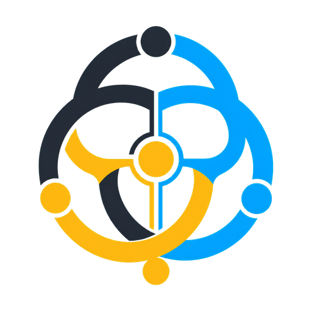
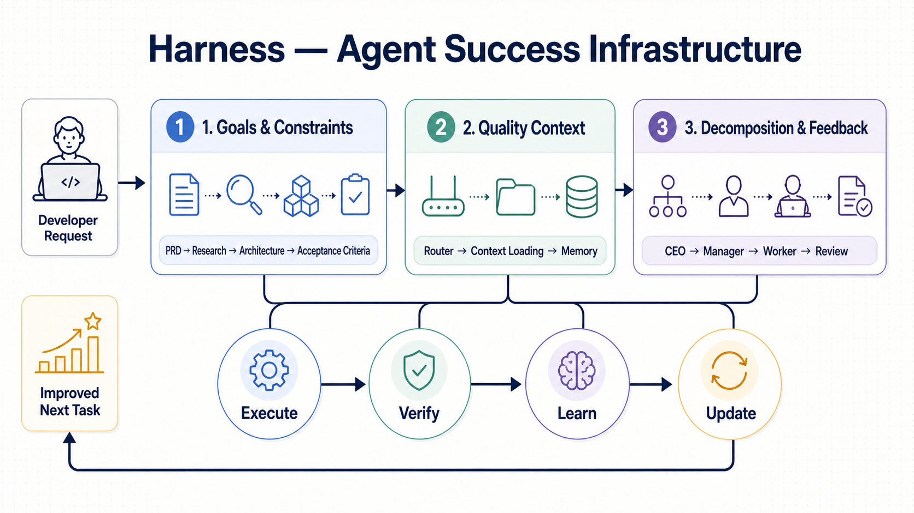

<p align="center">
  
  = 18">
  
  
</p>

<p align="center">
  
</p>

<h1 align="center">create-harness-vibe-coding</h1>
<p align="center">
  <b>An operating contract for reliable AI coding agents.</b><br>
  <sub>Goals. Context. Loops. Evidence.</sub>
</p>

<p align="center">
  <a href="README-CN.md">Chinese</a> |
  <a href="https://github.com/LiWeny16/create-harness-vibe-coding">GitHub</a> |
  <a href="https://www.npmjs.com/package/create-harness-vibe-coding">npm</a>
</p>

`create-harness-vibe-coding` is a Node.js CLI that scaffolds a repo-local harness for AI-assisted software development: research, PRD, architecture, task decomposition, implementation, testing, review, recovery, and durable memory.

It is not a prompt pack and it does not generate business code. It gives Claude Code, Codex, and compatible agents a shared operating system for long-running work.

## The short version

Without a framework:

```text
Idea -> prompt -> patch -> demo -> rediscover context -> repair drift
```

With Harness:

```text
Idea -> Research -> PRD -> Architecture -> Acceptance Criteria
     -> Build -> Test -> Review -> Verify -> Learn -> Update
```

## Measured status in 0.8.16

Current evidence in this repository:

- HarnessBench v0.2 local lifecycle proof: 15 runs per mode. Direct file writes completed safely in 3/15 runs; the Harness safe path completed safely in 15/15 runs.
- Protected overwrites in that proof: 21 for direct file writes, 0 for the Harness safe path.
- Claude Code L2 prompt-cache sample: `harness-thin` reached `98.7%` warm median cache read (`+5.4` percentage points vs provider-control); `/wf` wf-light reached `99.1%` (`+5.8` percentage points).
- Startup and update chain: thin startup remains the default, `Harness/specs/guides/SETUP.md` is only setup/migration reference material, and `/wf-update` reports `agent.releaseHighlights` plus validation results.

## One-line install (recommended for existing repos)

Paste this into your agent:

> Please install the Harness framework by following https://github.com/LiWeny16/create-harness-vibe-coding/blob/main/README.md.

## Installation instructions (Agent instruction)

After reading this README, the agent selects the path that matches the project:

| Project state | Agent action |
|---|---|
| New project | `npx create-harness-vibe-coding@latest my-project -y` |
| Existing project | `npx create-harness-vibe-coding@latest my-project . -y --on-conflict skip --json` |
| Existing `Harness/` with `Harness/scripts/wf-update-check.mjs` | `node Harness/scripts/wf-update-check.mjs --json`; update, do not reinstall; after apply/finalize, report `agent.releaseHighlights` plus validation results |
| Existing `Harness/` but missing `Harness/scripts/wf-update-check.mjs` | `npx create-harness-vibe-coding@latest my-project . -y --on-conflict skip --json`. Then run `node Harness/scripts/wf-update-check.mjs --json` |
| After install or update | `node Harness/scripts/validate-harness.mjs --strict` |

Install scope policy: the CLI defaults to `global` for a new or empty target, and to `project` for an existing non-empty target so older repositories keep their historical behavior. An explicit `--install-scope project|global` always wins. For the production setup, install once per machine with `npm i -g create-harness-vibe-coding`, then run `create-harness-vibe-coding init .` (or `/wf-init`) inside each project. The global runtime is the single version source of truth for commands, skills, agents, scripts, and the wf-ui server/assets; each project keeps its bridge docs and state (`Harness/tasks/`, `Harness/PROGRESS.md`, memory, facts, and settings). `wf-ui` is included in that same runtime and lazy-loaded only when invoked, so starting the UI does not trigger a second download. Use `--install-scope project` for a self-contained or offline/CI install; use `--global-dir <dir>` and `--host-global-dir <dir>` when the shared locations must be explicit.

After installation, hand off by phase: use `CLAUDE.md` as the normal session entry, use `Harness/specs/guides/SETUP.md` only for install/bootstrap, migration, or upgrade decisions, and use `Harness/README.md` as the Harness workflow router when a routed task needs it. Preserve project boundaries; research and plan before editing; run tests, validation, and review before claiming completion.

The user does not need to run commands manually. The agent handles installation, conflict handling, validation, and the handoff.

## Which WF command should you use?

When in doubt, use `/wf-help` (or `$wf-help` in Codex). It returns the full command table. Use `/wf` for complex work and `/wf-max` when the work can be safely parallelized.

| Command | Use it when | What it does | Example |
|---|---|---|---|
| `/wf <task>` | Multi-file, architectural, risky, migration, or repeatedly failing work | Research -> plan -> implement -> test -> review -> verify -> reflect | `/wf refactor the payment module and add tests` |
| `/wf-max <task>` | The task splits into independent work and needs maximum parallelism | Adds CEO -> Manager -> Worker roles and parallel waves to the full WF chain | `/wf-max upgrade frontend, backend, and docs in parallel` |
| `/wf-auto` | You want continuous self-directed optimization with adaptive probe selection | Runs repeated optimization cycles with plans, evidence, and feedback | `/wf-auto improve this project's stability` |
| `/wf-auto-spark` | You need external inspiration, competitive direction, or a long-term roadmap | Searches for sparks, anchors work to a North Star and milestones, and guards scope drift | `/wf-auto-spark explore product growth directions` |
| `/wf-review [focus]` | You need a second opinion, peer review, or a pre-release check | Uses clean Harness-native reviewer subagents with bounded intelligent fan-out and classifies findings by severity | `/wf-review focus on security and data loss` |
| `/wf-learn` | The same mistakes keep recurring or a completed task needs to become reusable knowledge | Extracts generalized methods with anti-overfitting and route-load checks | `/wf-learn summarize why this task needed rework` |
| `/wf-browser <task>` | Browser smoke tests, E2E, screenshots, forms, or UI verification | Uses a real browser and returns screenshots, traces, and evidence | `/wf-browser verify login and checkout` |
| `/wf-ui` | Open the Harness control panel for task management, workflow graphs, agents, and settings | Directly starts the local backend and browser UI on 127.0.0.1 | `/wf-ui` |
| `/wf-readme <task>` | README, install docs, architecture diagrams, or project docs need work | Preserves facts while improving structure, setup, and usage guidance | `/wf-readme improve the Chinese README` |
| `/wf-update` | Harness is already installed and needs an update | Compares versions, applies safe changes, leaves semantic conflicts to the agent, and reports release highlights from the changelog metadata | `/wf-update` |
| `/wf-search` | A task needs a real tool search with verifiable sources and claims | Organizes one search into a structured ledger (operations/sources/claims), validates it with a stateless Node helper, and renders a Markdown evidence report; reports save to `Harness/research/search/` | `/wf-search --mode fact "node:test runner exit codes"` |
| `/wf-remove` | You need to uninstall Harness | Removes safe files, preserves user data, and asks before touching conflicts |
| `/wf-init` | You installed the global runtime and want a new project to use it | Writes only project bridge docs and project-local state; framework files and versioning stay in the global runtime | `/wf-remove` |
| `/wf-help` | You do not know which command to use | Returns command usage without starting a workflow | `/wf-help` |

Claude Code uses `/wf-*`; Codex uses the matching `$wf-*`; OpenCode uses the registered command or Agent instruction. Browser E2E guidance is built into `wf-browser`. `/wf-auto` and `/wf-auto-spark` are continuous modes, so give the agent a clear goal, scope, and acceptance criteria before starting.

Common starting points: Web/API work starts with correctness, security, reliability, and verification; CLI/SDK work starts with contracts, compatibility, error UX, and docs; AI-agent work starts with context quality, tool safety, evaluation, and recovery; data jobs start with idempotency, failure recovery, and observability. See the full [WF-AUTO-ANGLES.md](Harness/specs/workflows/WF-AUTO-ANGLES.md) selection protocol.

Chinese README: [README-CN.md](README-CN.md)

### Harness intelligence routing

Workflow entry points create a bounded, role-scoped task context pack before
dispatch and regenerate it on resume. External research is conditional: the
local policy checks capability gaps, volatile APIs, explicit requests, repeated
failures, or benchmark gaps before an agent reads current web, GitHub, or
Hugging Face sources. Source URL, version/terms, date, and adopt/adapt/reject
rationale remain part of task evidence. Packs and structural checks improve
boundaries but do not replace semantic validation.

`/wf-max` uses evidence-driven WF-Max-Useful fan-out by default; a dependency
chain, absent independent acceptance, or coordination cost without benefit may
be recorded as no-spawn. WF-Max-Strict is enabled only by an explicit strict
request and remains bounded by actual runtime capacity. Direct commands such as
`/wf-help`, `/wf-task-list`, `/wf-init`, and `/wf-update` stay direct and do not
force task routing or external research.

## Measured difference

Harness does not make the model smarter. It reduces uncontrolled parts of agent
work: which files may change, how conflicts are handled, how recovery works, and
what evidence counts as complete.

The current published benchmark is a deterministic local lifecycle proof, not a
full LLM feature-success A/B result. It creates 5 fixture families x 3 seeds per
mode and checks the filesystem after each run. See
[HarnessBench v0.2](docs/benchmarks/HarnessBench.md).

Benchmark assets stay outside generated installs: users get the published
summary, not the runner, fixtures, scorer, or raw logs.

### HarnessBench local lifecycle proof

Run on 2026-07-26:

```bash
node scripts/harness-bench-local.mjs --output benchmarks/results/harnessbench-local-v0.2.json
node scripts/harness-bench.mjs --input benchmarks/results/harnessbench-local-v0.2.json --markdown
```

| Mode | Tasks | Runs | Verified safe | Protected overwrites | Repair-triggering runs | Manual repair events | Required-file misses | Benchmark leaks | Boundary violations |
|---|---:|---:|---:|---:|---:|---:|---:|---:|---:|
| No Harness baseline (direct file writes) (`direct-run`) | 5 | 15 | 3/15 (20%) | 21 | 12 | 21 | 0 | 0 | 12 |
| Harness safe path (`harness-wf`) | 5 | 15 | 15/15 (100%) | 0 | 0 | 0 | 0 | 0 | 0 |

What this proves: Harness has measurable boundary value for fresh install,
existing-project preservation, same-name user skill protection, old-Harness
updater recovery, and generated-install benchmark exclusion. It does not prove
that any model solves arbitrary frontend, backend, or embedded feature work at a
higher rate. That requires the full HarnessBench LLM A/B suite with raw run
logs.

### Prompt-cache L2 sample

On 2026-07-23, this dogfood repository ran a bounded Claude Code L2 prompt-cache probe with `node Harness/scripts/l2-cache-telemetry.mjs --groups provider-control,harness-thin,wf-light --turns 11 --turn-budget-usd 0.32 --total-budget-usd 1.20 --timeout-ms 240000`.

Source: Claude Code JSON usage fields, especially `usage.cache_read_input_tokens` and `usage.cache_creation_input_tokens`. Read ratio is `cache_read_input_tokens / (input_tokens + cache_creation_input_tokens + cache_read_input_tokens)`. The raw local report is outside the repo at `~/.claude/cache-telemetry/harness-l2-claim-20260723-130331.json`.

| Route | Turns | Success | Warm median cache read | Warm range | Warm median latency | Uplift vs provider-control |
|---|---:|---:|---:|---:|---:|---:|
| provider-control | 11 | 11/11 | 93.3% | 91.1%-95.4% | 2123.5 ms | baseline |
| harness-thin | 11 | 11/11 | 98.7% | 98.1%-99.2% | 1786.5 ms | +5.4 percentage points |
| `/wf` wf-light | 11 | 11/11 | 99.1% | 98.7%-99.7% | 2900 ms | +5.8 percentage points |

Claim boundary: this proves real cache reads and a measured improvement in this bounded Claude Code sample. It is not a universal claim for every model, repository, task, or provider.

### Compared with adjacent tools

Harness is a repo-local operating contract. It can sit above Claude Code, Codex, OpenCode, or another agent instead of replacing them.

| Compared with | Primary layer | Harness advantage |
|---|---|---|
| Direct agent run | One prompt plus ad hoc context | Persistent task state, explicit write boundaries, verification gates, and recoverable handoff |
| [Claude Code](https://code.claude.com/docs/en/overview), [Codex](https://developers.openai.com/codex), [OpenCode](https://opencode.ai/docs/) | Coding agents and runtimes | Cross-runtime repo contract with the same commands, memory shape, validator, and update policy |
| [Aider](https://github.com/aider-ai/aider) | Terminal pair-programming, repo map, git/test loop | Harness focuses on install/update safety, task capsules, external benchmark evidence, and multi-runtime workflow routing |
| [Superpowers](https://github.com/obra/Superpowers) | Skills-based development methodology | Harness adds an npm scaffold, machine-readable ownership/version manifests, safe merge/update scripts, and generated repo-local state |

## Architecture

<p align="center">
  <a href="docs/images/harness-architecture-light.png">
    
  </a>
  <br>
  <sub>
    Light infographic - <a href="docs/images/harness-architecture.drawio">editable Drawio source</a>
  </sub>
</p>

The architecture has three pillars:

1. **Goals & Constraints** - PRD -> research -> architecture -> acceptance criteria.
2. **Quality Context** - a router, context-loading protocol, and durable memory keep attention on the right evidence.
3. **Decomposition & Feedback** - `/wf` and `/wf-max` assign bounded work, then review, verify, learn, and update the next task.

## What gets scaffolded

| Layer | Purpose |
|---|---|
| `CLAUDE.md`, `AGENTS.md` | Agent session entry contract and compatibility pointer |
| `Harness/README.md`, `Harness/MEMORY.md` | Harness workflow router and resource index |
| `Harness/tasks/`, `Harness/PROGRESS.md` | Resumable task state across sessions |
| `.claude/`, `.agents/`, `.codex/`, `.opencode/` | Tool-specific discovery and configuration |
| `templates/common/`, `templates/optional/` | Declarative scaffold source and optional workflows |
| `Harness/scripts/validate-harness.mjs` | Structural and strict readiness checks |

The generated project starts with no business stack or generated application code. You choose the stack after bootstrap.

## Existing project: safe merge first

Paste this to your agent:

```text
Read and follow https://github.com/LiWeny16/create-harness-vibe-coding exactly to configure this project with create-harness-vibe-coding.
```

The agent-first path previews the target before writing and preserves project-owned files. `Harness/specs/guides/SETUP.md` is the retained bootstrap/migration reference created by the scaffold; it is not the normal session entry.

If `Harness/` already exists, first check whether `Harness/scripts/wf-update-check.mjs` exists. If it does, use `/wf-update`, `$wf-update`, or `node Harness/scripts/wf-update-check.mjs --json` instead of reinstalling blindly. If it is missing, run the safe CLI recovery command from the installation table first, then run the updater.

## Optional workflows

Ask your agent to add the capability you need:

> Add `ui-ux-review` and `ts-react-frontend` to this Harness project, preserve existing files, run the strict validator, and report exactly what changed.

| Workflow | Use it for |
|---|---|
| `ui-ux-review` | Responsive, accessibility, and polish review |
| `ts-react-frontend` | TypeScript, React, and Vite projects |
| `python-backend` | FastAPI and pytest projects |
| `github-pr-review` | PR diff review and CI evidence |

External recommendations are recorded in `Harness/specs/guides/SETUP.md`; they are not auto-installed.

| Recommendation | Use it for | Source |
|---|---|---|
| `superpowers` | Community agent skills and coding workflows | [Superpowers](https://github.com/obra/Superpowers) |
| `caveman` | Terse, low-token agent behavior | [Caveman](https://github.com/JuliusBrussee/caveman) |
| `agent-research` | Literature, product, dependency, and ecosystem research | [agent-research-skills](https://github.com/lingzhi227/agent-research-skills) |
| `codegraph` | Repository graph and architecture mapping | [CodeGraph](https://github.com/colbymchenry/codegraph) |
| `grill-me` | Relentless plan/design interview before implementation | [Grill Me](https://github.com/mattpocock/skills/tree/main/skills/productivity/grill-me) |

## Verify

```bash
# This package repository
npm test

# Generated project after safe merge
node Harness/scripts/validate-harness.mjs

# Generated project after bootstrap or before release
node Harness/scripts/validate-harness.mjs --strict

# After publishing an update release
npm run check:mirrors
```

## Ownership manifest

`Harness/ownership.manifest.json` is the machine-readable source of truth for file classification during install/update. It is auto-generated from `templates/common/` + `templates/optional/catalog.json` by `node scripts/build-version.mjs`. Framework-owned files overwrite-upgrade; user data (tasks, memory, research, README, package, PROGRESS) is preserved; CLAUDE/AGENTS/Harness README merge; same-name user agents/commands/skills (no marker) are never overwritten.

## Release gate

Iron rule: every update release must keep both update channels live:

- Canonical: npm `create-harness-vibe-coding@latest` and `https://github.com/LiWeny16/create-harness-vibe-coding`
- Legacy compatibility mirror: `https://github.com/zingspark/create-harness-vibe-coding`

Low-version installs can have updater scripts hardcoded to the legacy mirror. Do not mark a release complete until the legacy mirror exposes the same commit on `main`, the version tag, the generated template manifest (`templates/common/.harness-version` AND `templates/common/Harness/ownership.manifest.json`), and the tag's GitHub Release artifact, all matching canonical. Generated installs still record the canonical `LiWeny16` source; the `zingspark` repo is kept for backward compatibility.

"Code ready" is not "users can update". Users on published npm receive the new version only AFTER `npm publish` completes AND the GitHub release/tag is cut AND both mirrors are synced. Do not announce the update as available to existing users until all three are done.

## Footprint

| | |
|---|---|
| Runtime | None |
| Dependencies | 2 (`@clack/prompts`, `picocolors`) |
| Node.js | >=18 |
| Generated application code | None until you choose a stack |

## Keywords and related concepts

AI coding agent framework; agentic workflow; context engineering; long-running coding tasks; task orchestration; durable memory; safe merge; conflict handling; acceptance criteria; Claude Code; Codex; OpenCode; Node.js CLI; developer productivity

MIT (c) [LiWeny16](https://github.com/LiWeny16)
