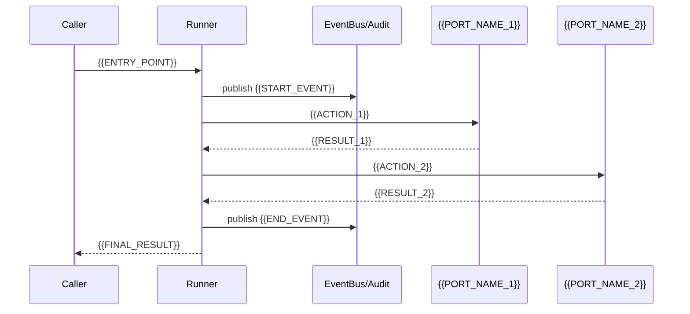

# Data Flow — {{projectName}}

> **Purpose**: Define the complete lifecycle of each event/request — happy path + all failure branches.
> **This is the most important file in the entire docs folder** — what AI most often invents during implementation is failure-path behavior. Write it clearly and it won't.
>
> Philosophy source: EventCatalog pattern + arc42 Chapter 6 (Runtime View).

---

## 1. Event Catalog

| Event Type | Producer | Consumer | Payload Key Fields | Delivery Semantics | Ordering Requirements |
| --- | --- | --- | --- | --- | --- |
| `{{EVENT_1}}` | `{{PRODUCER}}` | `{{CONSUMERS}}` | `{{KEY_FIELDS}}` | {{SEMANTICS}} | {{ORDERING}} |

---

## 2. Core Flows

### 2.1 Happy Path

### 2.2 Failure Paths

Each failure point must clearly document:
- **Trigger condition**
- **System behavior**
- **Event publishing**
- **Caller perception**
- **Recovery method**

---

## 3. Error Handling Conventions

- **Retryable errors**: {{POLICY}}
- **Non-retryable errors**: {{POLICY}}
- **Silent ignore**: {{POLICY}}

---

> **Note**: This data-flow.md is currently an empty template. Fill it in according to your project's actual flows. For format reference, see real project examples in the ECC repository.
