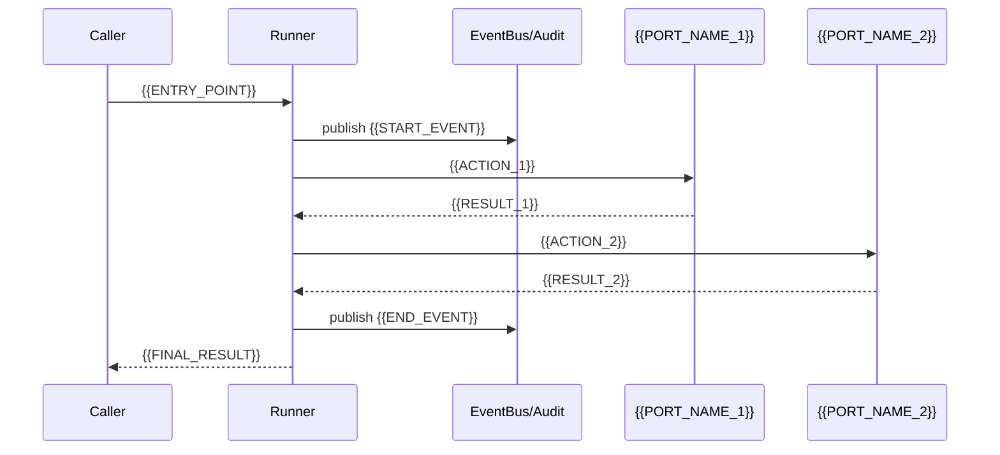

# 数据流 — {{projectName}}

> **职责**：定义每个事件/请求的完整生命周期——正常路径 + 所有失败分支。
> **这是整个 docs 里最重要的文件**——AI 实现时最常编造的就是失败路径行为。写清楚就不会。
>
> 哲学来源：EventCatalog 模式 + arc42 第 6 章 (Runtime View)。

---

## 1. 事件目录

| 事件类型 | 生产者 | 消费者 | Payload 关键字段 | 投递语义 | 排序要求 |
| --- | --- | --- | --- | --- | --- |
| `{{EVENT_1}}` | `{{PRODUCER}}` | `{{CONSUMERS}}` | `{{KEY_FIELDS}}` | {{SEMANTICS}} | {{ORDERING}} |

---

## 2. 核心流程

### 2.1 正常路径

### 2.2 失败路径

每个失败点必须写清：
- **触发条件**
- **系统行为**
- **事件发布**
- **调用方感知**
- **恢复方式**

---

## 3. 错误处理约定

- **可重试错误**：{{POLICY}}
- **不可重试错误**：{{POLICY}}
- **静默忽略**：{{POLICY}}

---

> **提示**：当前 data-flow.md 是空模板。请按项目实际流程填写。格式参考 ECC 仓库的实际项目示例。
